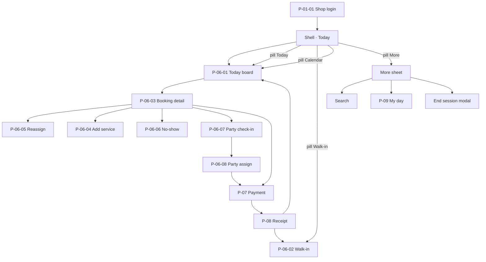

# Designer Brief — Miki Staff POS (IA)

**Version:** 1.1  
**Date:** July 2026  
**Audience:** Product design (wireframes / Penpot / screen composition)  
**Status:** Draft for design — screen-by-screen IA  
**Authority:** Sole SSOT for **Staff POS information architecture**, navigation model, screen list, component placement, and layout regions. Do not invent parallel POS nav trees elsewhere.

**Related SSOT (other concerns — not IA)**

| Concern | Doc |
| :--- | :--- |
| Product rules | [`../modules/barbershop/spec.md`](../modules/barbershop/spec.md) |
| Screen IDs (P-xx inventory) | [`../modules/barbershop/ui.md`](../modules/barbershop/ui.md) · Part 2 |
| Visual / UI design | [`../design/staff-pos-ui-design.md`](../design/staff-pos-ui-design.md) |
| Motion | [`../design/motion-prototype.md`](../design/motion-prototype.md) |
| Prototype | [`../../apps/staff-pos/`](../../apps/staff-pos/) |

---

## 1. What you are designing

The **Staff POS** — shared counter tablet for barbers/owners to run the floor: who’s next, check-in, cut lifecycle, walk-ins, party split, checkout, receipt.

**Not this brief**

- Merchant Portal (schedule, catalogue, payroll, reports)
- Customer web (book / status)
- Admin Portal

**IA model (locked)**

```
Login (full screen)
   ↓
Shell (persistent)
   ├── Offline banner (conditional)
   ├── Header (shop context + barber switcher only)
   ├── Main
   │     ├── Today board (home destination)
   │     └── Booking detail (panel lg+ · drawer portrait)
   └── BottomNavPill (floating) — Today · Walk-in · Calendar · More
   ↓
Overlays (one at a time, stacked above shell)
   Walk-in · Calendar peek · More sheet
   Search · My day · End session   ← via More (or direct)
   Reassign · Add service · No-show
   Party check-in · Party assign
   Payment → Receipt
```

There is **no sidebar**. Navigation is: **board as home** + **bottom pill** + **header attribution** + **overlays for tasks**.

---

## 2. Naming (locked)

| Term | Meaning |
| :--- | :--- |
| **Staff POS** | This product / surface |
| **Shell** | Persistent chrome after login (banner + header + main + bottom pill) |
| **Today board** | Floor view — lanes or timeline |
| **Booking detail** | Selected booking control panel / drawer |
| **BottomNavPill** | Floating pill nav at bottom — primary destinations / create |
| **More sheet** | Overlay opened from pill · More — secondary tools |
| **Acting barber** | Identity currently attributed for actions |
| **Manager** | Acting mode for shop-wide actions (not a separate app) |
| **Overlay** | Drawer, sheet, or modal above the shell |
| **P-xx** | Eng / design screen codes |

---

## 3. Bottom nav pill (locked)

### 3.1 Why a pill (not a tab bar)

- Thumb reach on counter tablet; doesn’t compete with barber switcher in the header  
- **Small** — 4 items max; icon + short label  
- Floats above content with safe margin (doesn’t eat board edge-to-edge)  
- Hides or dims behind blocking money modals (Payment / Receipt) so checkout stays focused  

### 3.2 The four items

| # | Item | Type | Opens / does | Selected when |
| :--- | :--- | :--- | :--- | :--- |
| 1 | **Today** | Destination | Shows Today board (lanes default) | Board visible; no Calendar peek |
| 2 | **Walk-in** | Action | Opens `WalkInDrawer` (P-06-02) | Never “selected” as a page — press = create |
| 3 | **Pay (Cashier)** | Destination | Opens cashier (order + keypad); barber-wash bg | Cashier open |
| 4 | **Calendar** | Destination / peek | Calendar peek (today timeline / slot strip) | Peek open or board in Timeline mode |
| 5 | **More** | Menu | Opens More sheet | Sheet open |

```
        ╭────────────────────────────────────────────╮
        │ Today  Walk-in  [Pay]  Calendar  More      │
        ╰────────────────────────────────────────────╯
              floating · Pay elevated in center
```

### 3.3 What each consists of

#### Today
- **Icon:** floor / grid / chairs metaphor (not a house if it reads “app home” only)  
- **Label:** Today  
- **Behaviour:** Dismisses Calendar peek if open; focuses board; does **not** clear an open booking detail on landscape unless product prefers reset  
- **Badge (optional):** late count or waiting count — use sparingly  

#### Walk-in
- **Icon:** + person or + ticket  
- **Label:** Walk-in  
- **Behaviour:** Always opens walk-in overlay; primary create path (moves off header)  
- **Visual:** May be slightly emphasized (filled / stronger weight) vs other three — still inside the same pill, not a separate FAB  

#### Calendar
- **Icon:** calendar / clock strip  
- **Label:** Calendar  
- **Behaviour (Phase 1):** **Calendar peek** — not Merchant Portal calendar  
  - Option A (preferred): switches board to **Timeline** view and scrolls to now  
  - Option B: opens a bottom/side peek sheet — hour axis for today only, tap slot/card → detail  
- **Not included:** multi-day edit, walk-in blocks config, caps — those stay in Portal  
- **Badge:** none  

#### More
- **Icon:** ··· or menu  
- **Label:** More  
- **Opens:** More sheet (list), containing:

| Row | Action | Notes |
| :--- | :--- | :--- |
| **Search** | Opens `SearchModal` | Find by name / # / phone / service |
| **My day** | Opens `StatsDrawer` (P-09) | Acting barber stats; Manager = shop |
| **End session** | Opens end-session confirm | Destructive / exit |
| Online status *(read-only in prod)* | Shows Online / Offline + pending | Banner remains source of truth when offline |
| Staff tools *(dev only)* | Demo time, offline toggle | Hidden in production |

**Not in More (ever):** Payroll, inventory, catalogue edit, reports depth, settings — Portal only.

### 3.4 What stays in the header (not in the pill)

| Stays in header | Why |
| :--- | :--- |
| Shop name · Today title | Context |
| **BarberSwitcher** | Attribution must stay visible without opening More |
| End session *(optional)* | Prefer **only** in More once pill ships — avoid duplicate exits |

| Leaves header → pill / More | Why |
| :--- | :--- |
| Walk-in button | Pill item 2 |
| Search | More → Search |
| My day | More → My day |

### 3.5 Visibility rules

| Context | Pill |
| :--- | :--- |
| Login | Hidden |
| Board / detail | Visible |
| Walk-in / party / reassign / add-service / search / my day / more | Visible (underlay) |
| Payment · Receipt · No-show confirm · End session | **Hidden or non-interactive** — money / confirm focus |
| Offline | Still visible; OfflineBanner remains top |

### 3.6 Layout specs (pill)

| Spec | Value |
| :--- | :--- |
| Position | Fixed bottom-center |
| Width | Hug content · max ~420px · horizontal margin ≥16px |
| Height | ≥56px touch row (icons + labels) |
| Shape | Pill (`rounded-full`) · surface `paper-white` · border `fog` · light shadow |
| Item hit | ≥48×48px each |
| Offset from bottom | Safe area + 12–16px |
| Board padding | Extra bottom padding so last cards clear the pill |

---

## 4. Global navigation map



| Entry | Opens | Returns to |
| :--- | :--- | :--- |
| Pill **Today** | Board (lanes) | — |
| Pill **Walk-in** | P-06-02 | Board (+ select new card) |
| Pill **Calendar** | Timeline / calendar peek | Board |
| Pill **More** | More sheet | Board |
| More → **Search** | Search modal | Board (+ select result) |
| More → **My day** | P-09 drawer | Board |
| More → **End session** | Confirm modal | Login if confirmed |
| Tap booking card | P-06-03 | Board (deselect / close) |
| Detail primary verb | Next lifecycle / Pay / Party | Same detail or overlay |
| Complete / Take payment | P-07 → P-08 | Board |

---

## 5. Shell layout (all authenticated screens)

### Layout — landscape (`≥1024px`)

```
┌──────────────────────────────────────────────────────────────┐
│ A · OfflineBanner (0px if online)                            │
├────────────────────┬─────────────────────────────────────────┤
│ B · Brand · Today  │ C · BarberSwitcher                      │
├────────────────────┴─────────────────┬───────────────────────┤
│ E · Today board (~58%)               │ F · Booking detail    │
│     FloorView                        │     (~42%, max ~28rem)│
│                                      │     or empty state    │
│                                      │                       │
│         ╭──────────────────────────────╮                     │
│         │ Today · Walk-in · Cal · More │  G · BottomNavPill  │
│         ╰──────────────────────────────╯                     │
└──────────────────────────────────────────────────────────────┘
```

### Layout — portrait (`<1024px`)

```
┌────────────────────────────┐
│ A · OfflineBanner          │
├────────────────────────────┤
│ B + C · Header (wrap)      │
├────────────────────────────┤
│ E · Today board (100%)     │
│                            │
│  ╭──────────────────────╮  │
│  │ Today Walk-in Cal …  │  │  G · BottomNavPill
│  ╰──────────────────────╯  │
└────────────────────────────┘
         ↓ tap card
┌────────────────────────────┐
│ F · Booking detail DRAWER  │
└────────────────────────────┘
```

### Shell components

| Region | Component | Role |
| :--- | :--- | :--- |
| A | `OfflineBanner` | System honesty; pending count |
| B | Shop label + “Today” | Context only |
| C | `BarberSwitcher` | Attribution (avatars + Manager) |
| E | `FloorView` | Floor truth |
| F | `BookingDrawer` (`panel` \| `drawer`) | Next verb |
| G | `BottomNavPill` | Today · Walk-in · Calendar · More |
| — | More sheet | Search · My day · End session |
| — | `Toast` | Non-blocking feedback |
| — | Overlay stack | Task flows (see later sections) |

**Prod note:** Prototype Demo / Online toggles live under More → Staff tools — hidden in production.

---

## 6. Screens — session

### P-01-01 Shop login

| | |
| :--- | :--- |
| **Purpose** | Start one terminal session for this device |
| **Entry** | App launch / after end session |
| **Exit** | Start session → Shell |

**Layout**

```
Full viewport · linen canvas
     ┌─────────────────────┐
     │  Eyebrow · Title    │
     │  Helper             │
     │  Email              │
     │  Password           │
     │  ☐ Stay logged in   │
     │  [ Start session ]  │
     └─────────────────────┘
        centered card ~24rem
```

**Components**

| Component | Notes |
| :--- | :--- |
| `LoginScreen` | Full-screen replace (not overlay) |
| Eyebrow | “Staff POS” |
| Title | “Shop login” |
| Email / Password fields | Required |
| Stay logged in | Checkbox |
| Primary CTA | Start session |

---

### P-01-02 Barber switcher *(persistent, not a page)*

| | |
| :--- | :--- |
| **Purpose** | Set acting barber / Manager without logout |
| **Placement** | Shell region C |

**Layout**

```
[ Avatar ] [ Avatar ] [ Avatar ] [ Manager ]
    ● active ring on current
```

**Components**

| Component | Notes |
| :--- | :--- |
| `BarberSwitcher` | Horizontal avatar rail |
| Avatar button | ≥48px hit; initial or photo |
| Manager chip | Distinct from barber avatars |
| Toast | “Now acting as …” on change |
| Lane header tap | Also switches acting (FloorView) |

---

### End session modal

| | |
| :--- | :--- |
| **Purpose** | Confirm exit to login |
| **Entry** | More sheet → End session |
| **Type** | Centered modal |

**Layout**

```
Scrim
  ┌──────────────────────┐
  │ End session?         │
  │ Helper (unsynced note)│
  │ [ End session ]      │
  │ [ Keep working ]     │
  └──────────────────────┘
```

**Components:** Title, body, primary destructive-ish confirm, ghost cancel.

---

## 7. Screens — floor (home)

### P-06-01 Today board

| | |
| :--- | :--- |
| **Purpose** | See all chairs / queue for today; pick a booking |
| **Home of POS** | Always visible in region E |
| **Views** | Lanes (default) · Timeline |

**Layout — board chrome**

```
┌─────────────────────────────────────────────┐
│  [All] [Hafiz] [Ivan] …     [Lanes|Timeline]│  ← filters
│  ⚠ N late — optional summary banner         │
│  WAITING QUEUE (if any)                     │
│  [card] [Take] …                            │
│                                             │
│  ┌ Lane ┐ ┌ Lane ┐ ┌ Lane ┐   OR timeline  │
│  │ Now  │ │ Now  │ │ Now  │                │
│  │ Wait │ │ Wait │ │ Wait │                │
│  │ Up   │ │ Up   │ │ Up   │                │
│  └──────┘ └──────┘ └──────┘                │
└─────────────────────────────────────────────┘
```

**Components**

| Component | Region | Notes |
| :--- | :--- | :--- |
| `FloorView` | E | Root |
| Staff filter chips | Top | All \| per barber |
| View toggle | Top | Lanes \| Timeline |
| Late summary banner | Below filters | When late upcoming exist |
| Shared waiting queue | Above lanes | Cross-lane + **Take** |
| `BookingCard` | In lanes / queue / timeline | Tap → select |
| Lane column | Lanes mode | Per barber |
| Lane header | Top of lane | Tap → set acting barber |
| Section labels | Now / Waiting / Upcoming | Inside lane |
| Timeline rows | Timeline mode | Hour axis + cards |
| Empty state | Board | Copy + rely on Walk-in CTA |

**BookingCard content (IA)**

1. Customer name (primary)  
2. Service · time · amount (meta)  
3. Badges: status · queue # · Party N · Online/Walk-in  
4. Late line if applicable  
5. Optional inline **Take** (waiting queue only)

**Selection behaviour**

- Landscape: select → detail panel updates (F)  
- Portrait: select → detail drawer opens  

---

## 8. Screens — booking lifecycle

### P-06-03 Booking detail

| | |
| :--- | :--- |
| **Purpose** | Control one booking; expose one next verb |
| **Hosts** | Panel (lg+) or drawer (portrait) |
| **Empty** | “Select a booking” when none selected (panel only) |

**Layout**

```
┌────────────────────────────┐
│ #42 · Online     [ × ]     │  header
│ Customer name              │
│ [Status]  late?            │
├────────────────────────────┤
│ tel link (optional)        │
│ ┌ Service summary card ┐   │
│ │ services · time · $  │   │
│ └──────────────────────┘   │
│ Overlap warning (cond.)    │
│ Party summary (cond.)      │
├────────────────────────────┤
│ ★ PRIMARY VERB (full width)│  sticky/footer actions
│ Secondary · Secondary …    │
└────────────────────────────┘
```

**Components**

| Component | Notes |
| :--- | :--- |
| `BookingDrawer` | `variant=panel\|drawer` |
| `BookingDetailEmpty` | Panel empty state |
| Header | Queue #, source, name, status pill, close |
| Phone link | `tel:` |
| Service summary card | Services, time, duration, barber, total |
| Overlap warning | Amber banner |
| Party summary block | Count + phase → routes to party flows |
| Primary verb button | State machine (see below) |
| Secondary actions | Ghost / outline row or stack |

**Primary verb by state (IA)**

| State | Primary | Opens / does |
| :--- | :--- | :--- |
| Upcoming | Mark arrived | Stay on detail |
| Arrived | Start cut | Stay |
| In chair | Complete | → may open Pay |
| Ready pay | Take payment | → P-07 |
| Party booked | Check in party | → P-06-07 |
| Party mid | Continue assign / pay | → P-06-08 / P-07 |

**Secondaries:** Reassign · Add service · No-show · Cancel (availability per rules).

---

### P-06-02 Walk-in

| | |
| :--- | :--- |
| **Purpose** | Create walk-in ticket fast |
| **Entry** | Pill Walk-in · Receipt “New walk-in” |
| **Type** | Right drawer / sheet |

**Layout**

```
┌────────────────────────────┐
│ New walk-in        [ × ]   │
├────────────────────────────┤
│ Name *                     │
│ Phone (optional)           │
│ Services (multi-select)    │
│ Barber: Anyone | specific  │
│ Slot picker                │
├────────────────────────────┤
│ [ Add walk-in ]            │
└────────────────────────────┘
```

**Components:** `WalkInDrawer` · text fields · service chips/list · barber picker · slot picker · primary submit.

---

### P-06-04 Add / change service

| | |
| :--- | :--- |
| **Purpose** | Mid-cut add-ons |
| **Entry** | Detail → Add service |
| **Type** | Drawer |

**Layout**

```
Header · Planned list · Catalogue add · Amber overlap warning · Save
```

**Components:** `AddServiceDrawer` · planned services · catalogue search/list · warning banner · Save.

---

### P-06-05 Reassign barber

| | |
| :--- | :--- |
| **Purpose** | Move booking before IN_SERVICE |
| **Entry** | Detail → Reassign |
| **Type** | Drawer |

**Layout**

```
Header · Barber list (avail / Full) · Confirm
```

**Components:** `ReassignBarberDrawer` · barber rows · confirm. Guard: hidden/disabled in chair.

---

### P-06-06 No-show confirm

| | |
| :--- | :--- |
| **Purpose** | Confirm no-show or escape if they arrived |
| **Entry** | Detail · auto late prompt |
| **Type** | Centered modal |

**Layout**

```
Scrim · “Mark no-show?” · [Mark no-show] · [They just arrived]
```

**Components:** `NoShowConfirmModal`.

---

## 9. Screens — party

### P-06-07 Party check-in

| | |
| :--- | :--- |
| **Purpose** | Who actually arrived before chair assign |
| **Entry** | Detail party CTA |
| **Type** | Drawer |

**Layout**

```
┌────────────────────────────────┐
│ #42 · Party of 3       [ × ]   │
│ Booked 3 · adjust before assign│
├────────────────────────────────┤
│ Member 1  services  [Here|NS]  │
│ Member 2  …         [Here|NS]  │
│ Member 3  …         [Here|NS]  │
├────────────────────────────────┤
│ [ Confirm arrival ]            │
└────────────────────────────────┘
```

**Components:** `PartyCheckInDrawer` · member rows · Here/No-show toggles · confirm → opens Assign.

---

### P-06-08 Party assign & parallel cuts

| | |
| :--- | :--- |
| **Purpose** | Split across barbers; run Start/Complete per member |
| **Entry** | After check-in |
| **Type** | Wide drawer / sheet |

**Layout**

```
┌──────────────────────────────────────────┐
│ Assign chairs                    [ × ]   │
│ Busy banner (cond.)                      │
│ [ Start all ready ]                      │
├──────────┬──────────┬────────────────────┤
│ Hafiz    │ Ivan     │ Amir               │
│ member…  │ member…  │ drop / list        │
│ Start    │ Complete │                    │
└──────────┴──────────┴────────────────────┘
```

**Components:** `PartyAssignDrawer` · chair columns · member cards · Start / Complete · Start all ready · busy banner. Exit when ready → P-07.

---

## 10. Screens — money

### P-07-01 Payment

| | |
| :--- | :--- |
| **Purpose** | Collect payment for completed (party: arrived members) |
| **Entry** | Complete / Take payment / party ready |
| **Type** | Drawer |

**Layout**

```
┌────────────────────────────────┐
│ Payment                  [ × ] │
├────────────────────────────────┤
│ Line items                     │
│  (party: name·svc·barber·$)    │
│ Subtotal                       │
│ Fee 2% (HitPay only)           │
│ TOTAL                         │
├────────────────────────────────┤
│ [HitPay QR] [HitPay card]      │  method tiles
│ [Cash]      [Own DuitNow]      │
├────────────────────────────────┤
│ [ Pay / Continue ]             │
└────────────────────────────────┘
```

**Components:** `CashierScreen` · line item list · totals block · method chips (Cash / QR / Card) · primary pay.

---

### P-07-02 HitPay waiting / timeout *(states of Payment)*

| State | Layout |
| :--- | :--- |
| **QR waiting** | Large QR · amount · “Waiting…” · cancel/back if allowed |
| **Card waiting** | Terminal guidance · amount · waiting |
| **Timeout** | “Payment issue?” · Retry · Other method · Record cash |

**Components:** Same drawer regions swap content; `QrCode` for QR mode.

---

### P-08-01 Receipt success

| | |
| :--- | :--- |
| **Purpose** | Confirm paid; hand off digital receipt |
| **Entry** | After successful pay |
| **Type** | Drawer / success sheet |

**Layout**

```
┌────────────────────────────────┐
│ Success treatment / ticket     │
│ Total · method                 │
│ Receipt QR                     │
├────────────────────────────────┤
│ [ Done ]                       │
│ [ New walk-in ]                │
└────────────────────────────────┘
```

**Components:** `ReceiptSuccessDrawer` · `ReceiptTicket` · `QrCode` · Done · New walk-in.

---

## 11. Screens — tools

### More sheet

| | |
| :--- | :--- |
| **Purpose** | Secondary tools that don’t earn a pill slot |
| **Entry** | Pill → More |
| **Type** | Bottom sheet or compact list drawer |

**Layout**

```
┌────────────────────────────────┐
│ More                     [ × ] │
├────────────────────────────────┤
│ Search →                       │
│ My day →                       │
│ ─────────────────              │
│ End session                    │
│ Online · N pending (if any)    │
└────────────────────────────────┘
```

**Components:** list rows (≥48px), navigates to Search / My day / End session.

---

### Search

| | |
| :--- | :--- |
| **Purpose** | Find booking under pressure |
| **Entry** | More → Search |
| **Type** | Modal / centered sheet |

**Layout**

```
Scrim · Search field · Results list (name · # · service · staff) · tap → select detail
```

**Components:** `SearchModal` · input · result rows.

---

### P-09-01 My day

| | |
| :--- | :--- |
| **Purpose** | Acting barber cuts + revenue (Manager = shop) |
| **Entry** | More → My day |
| **Type** | Drawer |

**Layout**

```
Header · Stat pair (cuts | revenue) · Recent transactions list
```

**Components:** `StatsDrawer` · stat tiles · tx rows.

---

### P-10-01 Offline *(banner, not a page)*

| | |
| :--- | :--- |
| **Purpose** | Announce offline + pending queue |
| **Placement** | Shell region A |

**Components:** `OfflineBanner` — copy “Offline — saving locally (N pending)”.

---

## 12. Overlay stacking rules (IA)

| Rule | Spec |
| :--- | :--- |
| Max intent | One primary task overlay at a time |
| Detail + overlay | Detail may close when opening Reassign / Add service / Party / Pay (current prototype pattern) |
| Payment → Receipt | Serial replace (pay closes, receipt opens) |
| Receipt → Walk-in | Receipt closes, walk-in opens |
| Toast | Never blocks; above content, below modal scrims if needed |
| Escape | Overlay close returns to board (+ detail if still selected) |

---

## 13. Screen inventory (design checklist)

| ID | Name | Container | Priority |
| :--- | :--- | :--- | :--- |
| — | Bottom nav pill | Shell | M |
| — | More sheet | Sheet | M |
| P-01-01 | Shop login | Full screen | M |
| P-01-02 | Barber switcher | Shell | M |
| — | End session | Modal | M |
| P-06-01 | Today board · Lanes | Main | M |
| P-06-01b | Today board · Timeline | Main | S |
| P-06-01c | Board empty | Main | S |
| P-06-03 | Booking detail · states | Panel/Drawer | M |
| P-06-03e | Detail empty | Panel | M |
| P-06-02 | Walk-in | Drawer | M |
| P-06-04 | Add service | Drawer | M |
| P-06-05 | Reassign | Drawer | M |
| P-06-06 | No-show | Modal | M |
| P-06-07 | Party check-in | Drawer | M |
| P-06-08 | Party assign | Drawer | M |
| P-07-01 | Payment | Drawer | M |
| P-07-02 | HitPay QR / Card / Timeout | Drawer states | M/S* |
| P-08-01 | Receipt success | Drawer | M |
| — | Search | Modal | M |
| P-09-01 | My day | Drawer | M |
| P-10-01 | Offline banner | Shell | M |

\*HitPay = Phase 1B; Cash/DuitNow = Phase 1A.

---

## 14. What not to put in POS IA

- Sidebar modules (Reports, Payroll, Inventory, Settings)
- Multi-day calendar as home (board is **Today**)
- Customer account management
- Deep catalogue editing
- Shop setup / billing

Those stay in **Merchant Portal**.

---

## 15. Revision

| Version | Date | Notes |
| :--- | :--- | :--- |
| 1.0 | 2026-07-27 | Initial Staff POS IA — screen-by-screen components & layouts |
| 1.1 | 2026-07-27 | Bottom floating pill: Today · Walk-in · Calendar · More; header slimmed to attribution |
