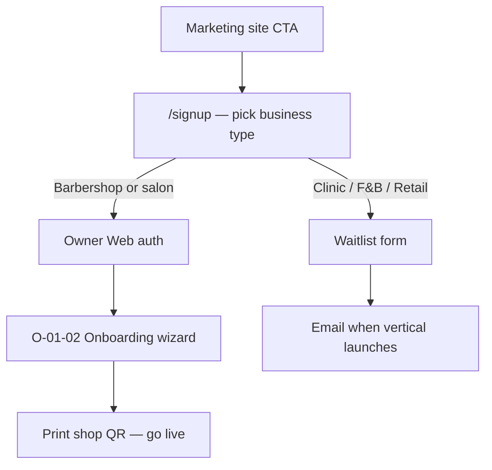

# Marketing Website — Structure & Copy Outline

**Status:** Draft v2 — Miki naming locked  
**Last updated:** 2 July 2026  
**Related:** [`../modules/barbershop/ui.md`](../modules/barbershop/ui.md) · [`../modules/barbershop/features-and-pricing.md`](../modules/barbershop/features-and-pricing.md) · [`../planning/initial-brd.md`](../planning/initial-brd.md)

---

## Purpose

The marketing website is the **front door for all business types**. It attracts leads, explains the platform, and routes signups by vertical. Product depth and pricing vary by business type — not every vertical ships on day one.

**Build priority:** Barbershop remains Phase 1 product. The site casts a wider net without over-promising on unreleased verticals.

**Sign-up destination:** Owner Web (`O-01` auth + `O-01-02` onboarding wizard) for live verticals. Waitlist for coming-soon verticals.

---

## Locked decisions

| # | Decision | Choice |
| :--- | :--- | :--- |
| 1 | Company & product name | **Miki** |
| 2 | Brand mark | **Miki** wordmark · accent `#38CE87` |
| 3 | Site scope | Multi-vertical hub (not barbershop-only marketing) |
| 4 | Clinics & aesthetics | **Coming soon** (waitlist) |
| 5 | Barbershop & salon | **Available now** → full Owner Web signup |
| 6 | F&B, retail, pop-up | **Coming soon** → waitlist |
| 7 | Founding promo banner | **Barbershop only** — RM89/mo locked, first 50 shops per city |
| 8 | Payments on site | Mention integrated QR & card early; **never name HitPay** |
| 9 | Visuals | **Mockups** (illustrated UI in device frames — no real screenshots yet) |
| 10 | Domain | **TBD** — `hello@miki.my` in copy until live |
| 11 | Primary CTA | **Start 14-day free trial** → Owner Web signup |
| 12 | Comparison page | **Yes** — vs StoreHub |
| 13 | Legal pages | **Stub OK** for draft (Privacy, Terms) |
| 14 | Language | **English only** (v1) |
| 15 | Waitlist fields | **Email + WhatsApp** |
| 16 | Contact | hello@miki.my *(until domain live)* |

---

## Design read

Multi-vertical B2B SaaS hub for Malaysian shop owners. Confident and transparent like Supabase / Ramp / Wise. Editorial punch from Bajgart Office. Warm, conversational honesty from Wimp Decaf. Bold product moments like MetaMask.

**Audience:** Shop owners sceptical of "another POS" — barbers first, broader SMEs over time.

---

## Visual system

> **Token SSOT:** [`../platform/design-system/tokens.json`](../platform/design-system/tokens.json) · **Penpot:** [`penpot-setup.md`](penpot-setup.md)

| Token | Value | Use |
| :--- | :--- | :--- |
| `--color-primary` | `#38CE87` | CTAs, links, Miki accent, success, accent lines |
| `--color-ink` | `#1C1C1C` | Headlines, body, nav, promo banner background |
| `--color-surface` | `#FAFAFA` | Page background |
| `--color-muted` | `#6B6B6B` | Secondary copy |
| `--color-border` | `#E8E8E8` | Cards, dividers |

### Typography (draft)

| Role | Font | Notes |
| :--- | :--- | :--- |
| Headlines | Instrument Sans or DM Sans | Clean SaaS — avoid Inter |
| Body | IBM Plex Sans | Readable for shop owners |
| Accent | Italic emphasis | One word per headline (Bajgart-style) |

### Motion

Subtle scroll reveals on feature blocks. Green pulse on primary CTA hover. No infinite-loop animations.

### Mockups

Device frames showing three surfaces:

1. Customer phone (QR booking)
2. Counter tablet (shared POS)
3. Owner laptop (calendar / reports)

Illustrated UI — not production screenshots.

### Logo

**Miki** wordmark in nav and footer. Accent colour `#38CE87` until final logo asset is exported from Penpot.

---

## Voice & copy rules

### Borrow from references

| Source | What to borrow |
| :--- | :--- |
| [Supabase](https://supabase.com/) | Short punchy headlines. "Start in minutes." Modular feature tiles. |
| [Ramp](https://ramp.com/) | Outcome numbers. Comparison tables. |
| [Wise](https://wise.com/) | Radical pricing transparency. Fee breakdowns. Trust blocks. |
| [MetaMask](https://metamask.io/) | Bold section headers. Product-as-hero stacking. |
| [Wimp Decaf](https://www.wimpdecaf.com/) | Conversational asides. Honest problem framing. |
| [Bajgart Office](https://bajgartoffice.com/) | Editorial rhythm. Italic emphasis. Short lines. |

### Tone

Direct, warm, zero enterprise jargon. Write for a barber-owner who already distrusts "another POS."

### Avoid

- Partner names (HitPay, etc.)
- "All-in-one POS for everyone"
- AI-purple gradients, generic three equal cards
- Over-promising on coming-soon verticals

---

## Vertical routing

| Vertical | Site badge | Signup action | Pricing on site |
| :--- | :--- | :--- | :--- |
| **Barbershop & salon** | Available now | Owner Web signup (full flow) | Ocelot / Mantis / Patriot |
| **Clinic & aesthetic** | Coming soon | Waitlist (email + WhatsApp) | "Announced at launch" |
| **F&B & café** | Coming soon | Waitlist (email + WhatsApp) | "Announced at launch" |
| **Retail & pop-up** | Coming soon | Waitlist (email + WhatsApp) | "Announced at launch" |

---

## Site map

```
/                     Home
/pricing              Vertical-aware pricing
/features             Product deep-dive
/how-it-works         3-surface journey
/compare              vs StoreHub
/signup               Business type picker → Owner Web or waitlist
/privacy              Stub
/terms                Stub
```

### Global elements

| Element | Spec |
| :--- | :--- |
| **Promo banner** | Sticky. Barbershop only: *"First 50 barbershops per city — RM89/mo locked for life."* Green accent on `#1C1C1C` background. Dismissible. |
| **Nav** | **Miki** · Features · Pricing · How it works · Compare · **Start free trial** |
| **Footer** | **Miki** · Privacy · Terms · hello@miki.my |

---

## Signup flow



### `/signup` — business type gate

**Headline:** What kind of shop are you running?

| Card | Badge | Action |
| :--- | :--- | :--- |
| Barbershop or salon | **Available now** | → Owner Web signup |
| Clinic or aesthetic | Coming soon | → Waitlist (email + WhatsApp) |
| F&B or café | Coming soon | → Waitlist (email + WhatsApp) |
| Retail or pop-up | Coming soon | → Waitlist (email + WhatsApp) |

*Sub:* Not sure? Pick the closest match — you can change it later.

**Owner Web handoff (barbershop/salon):** Email · Password · Shop name · Phone → `O-01-02` onboarding wizard.

**Waitlist form (coming-soon verticals):** Name · Email · WhatsApp · Shop name (optional) · Business type (pre-selected).

---

## Page copy outline

### `/` — Home

#### Promo banner

> First 50 **barbershops** per city get **RM89/mo locked for life**. Start your 14-day trial — full features, no card required.

#### Hero

> The shop software that fits *how you actually work.*
>
> Barbershops are live today. Clinics, cafés, and retail are next. Customers book from QR. You run the counter from a shared tablet. Owners manage from the web. **Your iPad. Your DuitNow. No hardware bundle.**

`[Start free trial]` · `[See how it works]`

*Sub:* 14 days free · No card · BYOD included

#### Social proof strip (placeholder)

> Trusted by shop owners across Malaysia · BYOD · Self-serve setup

#### Section: Pick your business

> **One platform. *Four kinds of shops.* Pick yours.**

| Card | Badge | One-liner |
| :--- | :--- | :--- |
| Barbershop & salon | **Available now** | Walk-ins, bookings, and per-chair revenue — from one counter |
| Clinic & aesthetic | Coming soon | Appointments and waitlist from one QR — no EMR bloat |
| F&B & café | Coming soon | Table QR and counter tickets — not a franchise kitchen |
| Retail & pop-up | Coming soon | Tap checkout and simple catalogue — no warehouse maze |

`[Start free trial]` → `/signup`

#### Section: Three surfaces

> **One platform. Three screens. Zero confusion.**

| Surface | Copy |
| :--- | :--- |
| **Customer web** | Scan QR. Book a slot. Track queue #42. No app. No account. |
| **Counter POS** | One shared tablet. Switch barber. Mark arrived. Take payment. |
| **Owner web** | Calendar, caps, services, reports. Setup in one afternoon. |

*[Mockup: phone + tablet + laptop trio]*

#### Section: Why not another POS?

> **Your shop isn't a restaurant. *Your POS shouldn't act like one.***

- You don't need table QR and kitchen tickets — you need a queue that respects bookings *and* walk-ins.
- You don't need a RM2,000 hardware bundle — you have an iPad.
- You don't need checkout blocked unless customers pay through us — cash and your own DuitNow always work.

#### Section: Payments (no partner names)

> **Pay how you already pay. Upgrade when you're ready.**

| Method | Merchant fee | Customer pays |
| :--- | :--- | :--- |
| Cash | RM0 platform fee | Exact total |
| Your own DuitNow QR | RM0 platform fee | Exact total |
| Integrated QR & card *(Growth plan)* | RM0 merchant fee | Subtotal + 2% service fee |

*Integrated payments auto-match to the booking. No manual reconciliation.*

#### Section: Outcomes

> **Less noise at the counter. *More signal at close.***

| Outcome | Detail |
| :--- | :--- |
| Setup in one afternoon | Services, barbers, hours, print your shop QR |
| Hybrid queue | Online bookings and walk-ins, same day, no stolen slots |
| Per-barber economics | Revenue and cut count per chair, every day |
| Works offline | Mark arrived, take payment, sync when back online |

#### Section: Pricing teaser

> Plans from **RM109/mo**. 14-day full trial. No card to start.

`[See pricing]` · `[Compare with StoreHub]`

#### Section: FAQ (home — 3 items)

| Question | Answer |
| :--- | :--- |
| What happens after my trial? | Full features for 14 days. Subscribe or drop to free Lite (1 barber, 25 bookings/mo). Your shop QR keeps working. |
| Do my customers need an app? | No. They scan your QR and book in the browser. |
| Can I use my own DuitNow QR? | Yes. Always. We never block checkout. |

#### Footer CTA

> Ready to run a calmer shop?

`[Start free trial]`

---

### `/pricing`

**Headline:** Transparent pricing. No hidden hardware fees.

**Tab or filter:** `[Barbershop & salon]` `[Clinic — coming soon]` `[F&B — coming soon]` `[Retail — coming soon]`

#### Barbershop & salon (live)

| | **Ocelot** | **Mantis** | **Patriot** |
| :--- | :--- | :--- | :--- |
| Price | RM109/mo | RM199/mo | RM349/mo |
| Annual | RM1,090/yr | RM1,990/yr | RM3,490/yr |
| Barbers | Up to 4 | Up to 8 | Unlimited |
| Locations | 1 | 2 | Multi-branch |
| Online bookings | Unlimited | Unlimited | Unlimited |
| Calendar & caps | ✓ | ✓ | ✓ |
| Integrated QR & card | — | ✓ | ✓ |
| Reports & CSV | ✓ | ✓ | ✓ |
| Priority support | — | WhatsApp | SLA |

**Founding offer (green border callout):**

> **RM89/mo locked for life** — first 50 barbershops per city. Verify at signup.

**Trial note:**

> 14-day trial = full Ocelot. Day 15: subscribe, or continue free on Lite (1 barber, 25 bookings/mo). Your shop QR never stops working.

`[Start free trial]`

#### Coming-soon tabs (clinic, F&B, retail)

> We're building this next. Join the waitlist — founding pricing when we launch.

`[Join waitlist]` → email + WhatsApp form

---

### `/features`

**Headline:** Everything a service shop needs. Nothing a restaurant forced on you.

| Feature | Copy |
| :--- | :--- |
| QR booking | Customers book from your shop QR. Nickname + phone. No account. |
| Hybrid queue | Online slots and walk-ins coexist. Walk-ins don't steal booked times. |
| Shared counter POS | One tablet. Tap to switch barber. Every action attributed. |
| Per-barber calendar | Working hours, daily caps, walk-in-only blocks. |
| Add-ons at chair | Customer booked a cut? Add beard trim before payment. |
| Digital receipt | Customer gets a link. No SMS required. |
| Offline mode | POS keeps working. Syncs when you're back. |
| Integrated payments | QR and card on phone. Auto-matched to booking. Customer pays 2% service fee — not you. |
| Reports | Daily sales, per-barber revenue, no-show log, CSV export. |

---

### `/how-it-works`

**Headline:** From QR scan to paid receipt. One afternoon to set up.

| Step | Copy |
| :--- | :--- |
| 1. Sign up | Pick your business type. Add shop, barbers, services, hours. |
| 2. Print your QR | Stick it at the door. Customers book from their phone. |
| 3. Run the counter | Shared POS: arrived → in chair → complete → pay. |
| 4. Close the day | Per-barber revenue, payment split, export for your accountant. |

*[Mockup flow: 4 illustrated panels]*

---

### `/compare` — vs StoreHub

**Headline:** Built for chairs, not tables.

| | **Us** | **StoreHub** |
| :--- | :--- | :--- |
| Built for | Barbers, salons, service shops | F&B & retail first |
| Entry price | **RM109/mo** | RM122/mo (Starter) |
| Hardware | BYOD — use your iPad | Often bundled |
| Online booking + walk-in queue | Native hybrid | Add-on / bolt-on |
| Customer booking | QR web, no app | Varies |
| Own DuitNow at checkout | Always free | — |
| Integrated payments | Optional (Growth plan) | Integrated |
| Self-serve signup | Yes, minutes | Sales-assisted tiers |

*Fair note:* StoreHub is strong for restaurants and inventory-heavy retail. We're not trying to replace that — we're built for shops where the queue is the product.

`[Start free trial]`

---

### `/privacy` & `/terms`

Stub pages. Standard SaaS structure. PDPA mention for Malaysian merchants.

> Draft — legal review pending.

---

## Component checklist (build)

| Component | Notes |
| :--- | :--- |
| Promo banner | Dismissible. Barbershop-only RM89 offer. `#38CE87` on `#1C1C1C`. |
| Miki wordmark | Nav + footer |
| Vertical picker cards | Badge: Available now / Coming soon |
| Pricing table | Tab per vertical; Wise-style fee transparency |
| Comparison table | Us vs StoreHub |
| Device mockup trio | Phone · tablet · laptop |
| Trust strip | Placeholder logos |
| FAQ accordion | 6–8 items (expand from home's 3) |
| Waitlist form | Email + WhatsApp + name + shop name |
| Legal stubs | Privacy + Terms |

---

## Full FAQ (for `/features` or dedicated section)

| Question | Answer |
| :--- | :--- |
| What happens after my 14-day trial? | Subscribe to Ocelot, Mantis, or Patriot — or continue on free Lite. Lite keeps your QR live with limits (1 barber, 25 bookings/mo). |
| Do customers need to download an app? | No. QR opens a mobile web page. |
| Can I take cash and my own DuitNow? | Yes. RM0 platform fee. We never block checkout. |
| What are integrated payments? | **Lite:** capped RM5k/mo. **Ocelot:** unlimited. **Mantis+:** + reconcile. Customer 2% fee; merchant receives full subtotal. |
| How many barbers can I add? | Ocelot: 4 · Mantis: 8 · Patriot: unlimited. |
| Does it work offline? | POS queues actions locally and syncs when back online. |
| Is this only for barbershops? | Barbershops launch first. Clinics, F&B, and retail are on the roadmap — join the waitlist. |
| How is this different from StoreHub? | See our [comparison page](/compare). Short answer: we're queue-first for service shops, not table-first for restaurants. |

---

## Relationship to product surfaces

The marketing site is separate from the three Phase 1 product surfaces:

| Surface | Screen IDs | Doc section |
| :--- | :--- | :--- |
| Customer web | C-xx | [`../modules/barbershop/ui.md` § Part 1](../modules/barbershop/ui.md#part-1--customer-web) |
| POS (shared counter) | P-xx | [`../modules/barbershop/ui.md` § Part 2](../modules/barbershop/ui.md#part-2--pos-shared-counter) |
| Owner web | O-xx | [`../modules/barbershop/ui.md` § Part 3](../modules/barbershop/ui.md#part-3--owner-web) |
| **Marketing website** | M-xx *(this doc)* | Lead gen → signup routing |

**Also required (not a marketing page):** Backend API · Platform Admin (internal, later).

---

## Revision log

| Date | Change |
| :--- | :--- |
| 2 Jul 2026 | v2 — **Miki** naming locked. Wordmark in nav/footer. BYOD section in barbershop page order. |
| 30 Jun 2026 | v1 draft. Multi-vertical hub. Barbershop live; clinic/F&B/retail coming soon. Waitlist: email + WhatsApp. Founding offer barbershop-only. |
| 30 Jun 2026 | Penpot tokens synced — 5 sets, 43 tokens, Tokens page + swatches + Logo component. |
