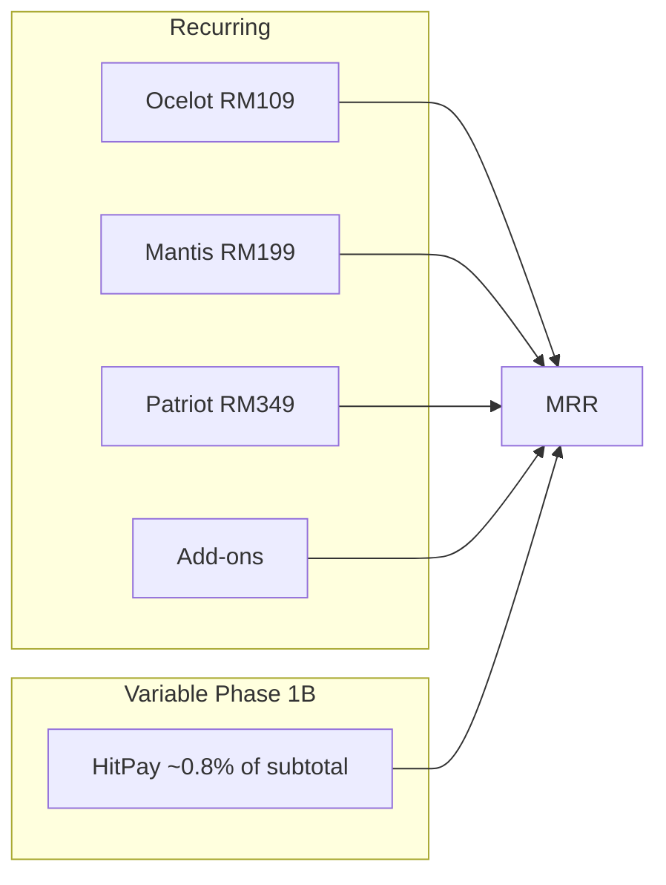

# Financial SSOT — Costing, Pricing, Forecasts & Cashflow

**Single source of truth** for barbershop POS financial planning.  
**Supersedes:** Scattered §5 figures in [`../planning/initial-brd.md`](../planning/initial-brd.md) for **operational planning** (strategy narrative stays there).  
**Related:** [`../product/features-and-packages.md`](../product/features-and-packages.md) · [`../product/barbershop-spec.md`](../product/barbershop-spec.md)

**Version:** 2.1 · **Date:** June 2026 · **Update when:** pricing, infra stack, HitPay terms, or forecast assumptions change.

---

## 0. How to use this document

| Section | Purpose |
| :--- | :--- |
| [§1 Assumption registry](#1-assumption-registry-inputs) | **Edit here first** — all models pull from these inputs |
| [§2 Pricing & revenue architecture](#2-pricing--revenue-architecture) | What we charge and how money flows |
| [§3 COGS & platform costs](#3-cogs--platform-costs) | Infra + variable cost per merchant |
| [§4 OPEX budget](#4-opex-budget-operating-expenses) | Fixed monthly/annual spend |
| [§5 Revenue forecast engine](#5-revenue-forecast-engine) | Formulas + 3-year scenarios |
| [§6 Expense forecast engine](#6-expense-forecast-engine) | Formulas + 3-year scenarios |
| [§7 SaaS metrics dashboard](#7-saas-metrics-dashboard) | KPI definitions + targets |
| [§8 Cashflow engine](#8-cashflow-engine) | Monthly cash bridge + runway |
| [§9 Decision thresholds](#9-decision-thresholds) | When you’re “safe” / “comfortable” |

**Rule:** One change → update §1 → recalc §5–§8. Do not maintain parallel spreadsheets without syncing assumptions back here.

---

## 1. Assumption registry (inputs)

### 1.1 Pricing (locked — Ocelot / Mantis / Patriot)

| ID | Input | Value | Notes |
| :--- | :--- | :--- | :--- |
| P-01 | Ocelot monthly | RM109 | vs StoreHub Starter RM122 |
| P-02 | Mantis monthly | RM199 | vs StoreHub Advanced RM235; includes HitPay |
| P-03 | Patriot monthly | RM349 | vs StoreHub Pro RM471 |
| P-04 | Founding Ocelot (locked) | RM89/mo | First 50 shops/city; ~8% of Ocelot payers |
| P-05 | Ocelot Lite | RM0 | Post-trial exit only — not signup tier |
| P-06 | HitPay platform take | 0.80% of service subtotal | Customer pays 2% surcharge; Mantis+ only |
| P-07 | HitPay partner share | ~1.20% of service subtotal | Of customer 2% fee; confirm with HitPay |
| P-08 | Annual prepay | 10 months paid = 12 months | 17% discount |
| P-09 | Extra barber add-on | RM19/mo | 9th+ chair |
| P-10 | Extra POS screen | RM29/mo | |
| P-11 | Priority WhatsApp | RM99/mo | Ocelot add-on; included Mantis+ |
| P-12 | Arsenal (enterprise avg) | RM500/mo | Sales-led; 2% of paying base Y3 |

### 1.2 Merchant mix (% of **paying** merchants)

| ID | Input | Y1 | Y2 | Y3 |
| :--- | :--- | :--- | :--- | :--- |
| M-01 | Ocelot % | 75% | 70% | 65% |
| M-02 | Mantis % | 18% | 22% | 25% |
| M-03 | Patriot % | 5% | 6% | 8% |
| M-04 | Arsenal % | 2% | 2% | 2% |
| M-05 | Annual prepay % | 10% | 25% | 40% |

**Blended SaaS ARPU (subscription only):**

```
Ocelot_effective = M-01 × ((1-Founding%) × P-01 + Founding% × P-04)
ARPU_saas = Ocelot_effective + (M-02 × P-02) + (M-03 × P-03) + (M-04 × P-12)
Founding% = 8% of Ocelot payers
```

| Year | ARPU_saas |
| :--- | :--- |
| Y1 | **RM144** |
| Y2 | **RM150** |
| Y3 | **RM157** |

### 1.2b Trial funnel (not in ARPU — drives paying count)

| ID | Input | Y1 | Y2 | Y3 |
| :--- | :--- | :--- | :--- | :--- |
| F-01 | Trial → paid (day 14) | 28% | 30% | 32% |
| F-02 | Lite → paid (monthly) | 5% | 6% | 7% |
| F-03 | Lite users as % of active | 45% | 35% | 28% |
| F-04 | Trials started / month (avg Y1 H2) | 8 | 12 | 15 |
| F-05 | Trial kill switch | <22% conv for 2 mo | Tighten Lite caps | |

**COGS uses total active merchants (paid + Lite). MRR uses paying only.**

### 1.3 Payment rail (Mantis + Patriot merchants)

| ID | Input | Y1 H2 | Y2 | Y3 |
| :--- | :--- | :--- | :--- | :--- |
| PAY-01 | Avg shop GMV / month | RM18,000 | RM22,000 | RM25,000 |
| PAY-02 | % GMV through HitPay (Mantis+ merchants) | 35% | 50% | 55% |
| PAY-03 | Platform take (of service subtotal) | 0.80% | 0.80% | 0.80% |
| PAY-04 | % paying merchants on Mantis+ | 15% | 28% | 38% |

**Payment net revenue per Mantis+ merchant / month** (fee on service subtotal, not customer total):

```
pay_merchant = PAY-01 × PAY-02 × PAY-03
             = 18000 × 0.35 × 0.008 ≈ RM50  (Y1 H2 example)
```

| Year | pay_merchant | PAY-04 | Blended ARPU_pay (all paying) |
| :--- | :--- | :--- | :--- |
| Y1 | RM50 | 15% | **RM8** |
| Y2 | RM88 | 28% | **RM25** |
| Y3 | RM110 | 38% | **RM42** |

### 1.4 Add-ons

| ID | Input | Value |
| :--- | :--- | :--- |
| A-01 | Attach rate (any add-on) | 8% Y1 → 15% Y3 |
| A-02 | Avg add-on revenue / attached merchant | RM25/mo |

```
ARPU_addons = A-01 × A-02
```

### 1.5 Merchant count scenarios (**paying**, end of period)

| Scenario | Y1 | Y2 | Y3 |
| :--- | :--- | :--- | :--- |
| **Downside** | 22 | 65 | 170 |
| **Base** | 45 | 130 | 360 |
| **Venture** | 70 | 220 | 650 |

*Total active (paid + Lite) ≈ 1.6× paying in Y1 → 1.3× Y2 → 1.2× Y3 as Lite ratio falls.*

### 1.6 Churn & growth

| ID | Input | Y1 | Y2 | Y3 |
| :--- | :--- | :--- | :--- | :--- |
| C-01 | Monthly logo churn (paying) | 7% | 5% | 4% |
| C-02 | Trial → paid conversion (day 14) | 28% | 30% | 32% |
| C-03 | CAC (blended) | RM450 | RM400 | RM350 |

### 1.7 COGS (platform — no SMS)

| ID | Input | Y1 | Y2 | Y3 |
| :--- | :--- | :--- | :--- | :--- |
| COGS-F | Fixed platform RM/mo | RM200 | RM350 | RM600 |
| COGS-V | Variable RM / merchant / mo | RM3 | RM4 | RM5 |
| COGS-P | HitPay partner share of customer 2% fee | ~60% | ~60% | ~60% |

**Platform net in PAY-03** (~0.8% of subtotal). Customer-facing surcharge is 2% — do not double-count partner share.

```
COGS_month = COGS-F + (merchants × COGS-V)
COGS_pct_subs = COGS_month / MRR_saas
```

**Target:** `COGS_pct_subs ≤ 20%` once merchants ≥ 15.

### 1.8 OPEX (non-COGS)

| ID | Line | Y1 RM/mo | Y2 RM/mo | Y3 RM/mo |
| :--- | :--- | :--- | :--- | :--- |
| OPEX-01 | Marketing (paid) | 500 | 2,500 | 6,000 |
| OPEX-02 | Legal / compliance | 200 | 250 | 300 |
| OPEX-03 | Software tools (non-infra) | 150 | 300 | 500 |
| OPEX-04 | Support hire | 0 | 2,500 | 6,000 |
| OPEX-05 | Misc / buffer | 150 | 450 | 1,200 |

```
OPEX_month = sum(OPEX-01..05)
```

### 1.9 Founder compensation (cashflow only)

| ID | Input | Y1 | Y2 | Y3 |
| :--- | :--- | :--- | :--- | :--- |
| SAL-01 | Founders drawing salary? | No | Partial | Yes |
| SAL-02 | Total founder cash / mo | RM0 | RM4,000 | RM10,000 |

---

## 2. Pricing & revenue architecture

### 2.1 Packages (summary)

| Package | Price | Revenue type |
| :--- | :--- | :--- |
| **Ocelot Lite** | RM0 | Trial exit — capped; not signup |
| **Ocelot** | RM109/mo · RM1,090/yr | Recurring SaaS |
| **Mantis** | RM199/mo · RM1,990/yr | SaaS + HitPay included |
| **Patriot** | RM349/mo · RM3,490/yr | SaaS + multi-branch |
| **Founding Ocelot** | RM89/mo locked | Promotional SaaS |
| **Arsenal** | Custom (~RM500+) | Enterprise |
| **Add-ons** | RM19–99/mo | Recurring |

Full feature gates: [`../product/features-and-packages.md`](../product/features-and-packages.md).

### 2.2 Revenue streams



| Stream | Recognition | Margin profile |
| :--- | :--- | :--- |
| **SaaS subscription** | Monthly / annual prepaid | **~80–95%** gross (target) |
| **HitPay platform net** | Per transaction (Mantis+) | **~100%** of PAY-03 (partner in P-07) |
| **Add-ons** | Monthly | **~90%** |

**Explicitly RM0 variable:** Cash · merchant own DuitNow QR.

### 2.3 MRR composition formula

```
MRR_total = MRR_saas + MRR_pay + MRR_addons

MRR_saas  = n_merchants × ARPU_saas
MRR_pay   = n_merchants × ARPU_pay    (blended across all merchants)
MRR_addons = n_merchants × ARPU_addons
```

### 2.4 ARR

```
ARR = MRR_total × 12
```

Annual prepay: cash collected upfront; MRR still recognized monthly for metrics.

---

## 3. COGS & platform costs

### 3.1 Stack (minimize — target ≤20% of subs)

| Component | Provider class | Y1 RM/mo |
| :--- | :--- | :--- |
| API hosting | Fly / Railway | 60–120 |
| PostgreSQL | Neon / Supabase | 0–80 |
| Auth | Clerk free tier | 0–40 |
| Static web (customer + app) | Cloudflare Pages | 0 |
| Object storage | R2 / S3 | 10–30 |
| Monitoring | Sentry free | 0 |
| Domain / email | | 20 |
| **≈ COGS-F** | | **~RM200** |

**Not in COGS:** founder eng time (sweat equity) · CAC · OPEX.

### 3.2 COGS by merchant count (no SMS)

| Merchants | Fixed | Variable (×RM3) | Total COGS | Need MRR_saas for 20% COGS |
| :--- | :--- | :--- | :--- | :--- |
| 10 | 200 | 30 | **RM230** | RM1,150/mo |
| 25 | 200 | 75 | **RM275** | RM1,375/mo |
| 50 | 250 | 150 | **RM400** | RM2,000/mo |
| 140 | 350 | 560 | **RM910** | RM4,550/mo |
| 400 | 600 | 2,000 | **RM2,600** | RM13,000/mo |

---

## 4. OPEX budget (operating expenses)

OPEX excludes COGS and payment partner fees (already in net take).

| Category | Y1 annual | Y2 annual | Y3 annual |
| :--- | :--- | :--- | :--- |
| Marketing | RM6,000 | RM30,000 | RM72,000 |
| Legal / compliance | RM2,400 | RM3,000 | RM3,600 |
| Tools | RM1,800 | RM3,600 | RM6,000 |
| Support staff | RM0 | RM30,000 | RM72,000 |
| Buffer | RM1,800 | RM5,400 | RM14,400 |
| **Total OPEX** | **RM12,000** | **RM72,000** | **RM168,000** |

**Y1 total cash out (COGS + OPEX, no salary):** ≈ RM200×12 + RM12×avg merchants×3 + RM12,000 ≈ **RM15,000–20,000** at base ramp.

---

## 5. Revenue forecast engine

### 5.1 End-of-year MRR (base scenario)

Using §1 inputs at **end-of-year paying merchant count**:

| | Y1 (45) | Y2 (130) | Y3 (360) |
| :--- | :--- | :--- | :--- |
| ARPU_saas | RM144 | RM150 | RM157 |
| **MRR_saas** | **RM6,480** | **RM19,500** | **RM56,520** |
| ARPU_pay | RM7 | RM22 | RM36 |
| **MRR_pay** | **RM315** | **RM2,860** | **RM12,960** |
| ARPU_addons | RM2 | RM4 | RM4 |
| **MRR_addons** | **RM90** | **RM520** | **RM1,440** |
| **MRR_total** | **RM6,885** | **RM22,880** | **RM70,920** |
| **ARR run-rate** | **RM82,620** | **RM274,560** | **RM851,040** |

*Higher ARPU vs Solo/Shop model compensates for slower paying count in Y1 (trial → Lite funnel).*

### 5.2 Annual revenue (base — use avg MRR × 12)

| | Y1 | Y2 | Y3 |
| :--- | :--- | :--- | :--- |
| Avg paying merchants | 25 | 88 | 250 |
| Avg MRR_total | RM3,800 | RM14,500 | RM48,000 |
| **Annual revenue** | **~RM22,000** | **~RM174,000** | **~RM576,000** |

*Y1 lower than end MRR × 12 because ramp from 0 at month 4 launch.*

### 5.3 Three scenarios — annual revenue

| Scenario | Y1 | Y2 | Y3 |
| :--- | :--- | :--- | :--- |
| **Downside** | RM12,000 | RM72,000 | RM220,000 |
| **Base** | RM22,000 | RM174,000 | RM576,000 |
| **Venture** | RM36,000 | RM280,000 | RM920,000 |

### 5.4 Year 1 monthly ramp (base — revenue forecast)

| Month | Paying | Lite (est.) | MRR_saas | MRR_pay | MRR_total | Notes |
| :--- | :--- | :--- | :--- | :--- | :--- | :--- |
| M1–3 | 0 | 0 | 0 | 0 | 0 | Build |
| M4 | 3 | 5 | 432 | 0 | 432 | Launch + trials |
| M5 | 7 | 11 | 1,008 | 0 | 1,008 | |
| M6 | 11 | 18 | 1,584 | 0 | 1,584 | |
| M7 | 16 | 24 | 2,304 | 0 | 2,304 | |
| M8 | 22 | 30 | 3,168 | 176 | 3,344 | Mantis / HitPay live |
| M9 | 28 | 36 | 4,032 | 196 | 4,228 | |
| M10 | 35 | 40 | 5,040 | 245 | 5,285 | PMF gate |
| M11 | 40 | 42 | 5,760 | 280 | 6,040 | |
| M12 | 45 | 45 | 6,480 | 315 | 6,795 | |

**Y1 sum of MRR_total ≈ RM18k–22k** · Monitor trial→paid ≥ 22%.

---

## 6. Expense forecast engine

### 6.1 Formulas

```
Expense_month = COGS_month + OPEX_month + Founder_draw_month

COGS_month = COGS-F + (merchants × COGS-V)

Gross_profit_month = Revenue_month - COGS_month

Operating_profit_month = Gross_profit_month - OPEX_month
                       (= EBITDA approx, pre-salary)

Net_cash_month = Operating_profit_month - Founder_draw_month
```

### 6.2 Annual expense forecast (base)

| | Y1 | Y2 | Y3 |
| :--- | :--- | :--- | :--- |
| COGS (annual) | RM4,500 | RM12,000 | RM35,000 |
| OPEX | RM12,000 | RM72,000 | RM168,000 |
| Founder draw | RM0 | RM48,000 | RM120,000 |
| **Total expenses** | **RM16,500** | **RM132,000** | **RM323,000** |

### 6.3 Profitability (base)

| | Y1 | Y2 | Y3 |
| :--- | :--- | :--- | :--- |
| Revenue | RM22,000 | RM174,000 | RM576,000 |
| Total expenses | RM16,500 | RM132,000 | RM323,000 |
| **Net (pre-tax)** | **RM5,500** | **RM42,000** | **RM253,000** |

Y2 positive on base path with higher ARPU · **2-founder salary from ~M24** (~74 paying) · delay draw to M18+ if downside.

---

## 7. SaaS metrics dashboard

Track monthly. Copy to spreadsheet with same column names.

### 7.1 Core revenue metrics

| Metric | Formula | Y1 target | Y2 target |
| :--- | :--- | :--- | :--- |
| **Paying merchants** | Count active subscriptions | 45 | 130 |
| **Lite merchants** | Post-trial free | 45 | 50 |
| **MRR_saas** | Sum subscription invoices | RM6,480 | RM19,500 |
| **MRR_pay** | HitPay platform net | RM315 | RM2,860 |
| **MRR_total** | SaaS + pay + addons | RM6,885 | RM22,880 |
| **ARR** | MRR_total × 12 | RM82,620 | RM274,560 |
| **ARPU_saas** | MRR_saas / paying | RM144 | RM150 |
| **ARPU_total** | MRR_total / paying | RM153 | RM176 |

### 7.2 Unit economics

| Metric | Formula | Target |
| :--- | :--- | :--- |
| **Gross margin (subs)** | (MRR_saas - COGS) / MRR_saas | **≥ 80%** |
| **COGS % of subs** | COGS / MRR_saas | **≤ 20%** |
| **Monthly churn** | Lost merchants / start merchants | **< 7% Y1 → < 5% Y2** |
| **Net revenue retention** | (MRR_start + expansion - churn) / MRR_start | **> 90%** Y2 |
| **CAC** | S&M spend / new merchants | **< RM500** |
| **LTV (subs)** | ARPU_saas × gross_margin × avg_life_mo | |
| **Avg life (mo)** | 1 / churn_rate | ~14 mo @ 7% churn |
| **LTV** | 144 × 0.88 × 14 ≈ **RM1,770** | |
| **LTV:CAC** | LTV / CAC | **> 3** |
| **CAC payback (mo)** | CAC / (ARPU_saas × gross_margin) | **< 6 mo** |

### 7.3 Growth metrics

| Metric | Formula | Target |
| :--- | :--- | :--- |
| **New merchants** | Gross adds this month | — |
| **Churned merchants** | Cancellations | — |
| **Net adds** | New - churned | — |
| **Trial starts** | Signups entering 14-day trial | — |
| **Trial → paid (day 14)** | F-01 | **≥ 28%** |
| **Lite → paid (monthly)** | F-02 | **≥ 5%** |
| **Lite % of active** | F-03 | **< 45%** Y1 |
| **MRR growth %** | (MRR_this - MRR_last) / MRR_last | — |

### 7.4 Cash metrics

| Metric | Formula | Healthy |
| :--- | :--- | :--- |
| **Burn rate** | Expenses - revenue (if negative profit) | Falling |
| **Runway (mo)** | Cash_balance / burn_rate | **> 6** bootstrap |
| **Cash collected** | Includes annual prepay upfront | |
| **MRR / burn** | Efficiency | **> 0.5** by M12 |

### 7.5 Dashboard layout (one screen)

```
┌─────────────────────────────────────────────────────────┐
│  MRR_total    ARR        Paying    Lite    ARPU_total   │
│  RM6,885      RM83k      45        45      RM153         │
├─────────────────────────────────────────────────────────┤
│  MRR_saas │ MRR_pay │ COGS%subs │ Trial→paid │ Lite%    │
│  RM6,480  │ RM315   │ 12%       │ 28%        │ 50%      │
├─────────────────────────────────────────────────────────┤
│  Churn %  │ New │ Net adds │ LTV:CAC │ Lite→paid/mo     │
│  6%       │ 8   │ +3       │ 3.9     │ 5%               │
└─────────────────────────────────────────────────────────┘
```

---

## 8. Cashflow engine

### 8.1 Monthly cashflow formula

```
Opening_cash
+ Cash_in (collected revenue, incl. annual prepay)
- COGS_cash
- OPEX_cash
- Founder_draw
- One_time (legal setup, etc.)
= Closing_cash
```

**Opening M4 example:** RM30,000 bootstrap in bank.

### 8.2 Base scenario — Year 1 cashflow (RM)

| Month | Open | Revenue in | COGS | OPEX | Draw | Close |
| :--- | :--- | :--- | :--- | :--- | :--- | :--- |
| M1 | 30,000 | 0 | 200 | 1,000 | 0 | 28,800 |
| M2 | 28,800 | 0 | 200 | 1,000 | 0 | 27,600 |
| M3 | 27,600 | 0 | 200 | 1,000 | 0 | 26,400 |
| M4 | 26,400 | 432 | 215 | 1,000 | 0 | 25,617 |
| M5 | 25,617 | 1,008 | 233 | 1,000 | 0 | 25,392 |
| M6 | 25,392 | 1,584 | 254 | 1,000 | 0 | 25,722 |
| M7 | 25,722 | 2,304 | 272 | 1,000 | 0 | 26,754 |
| M8 | 26,754 | 3,322 | 290 | 1,000 | 0 | 28,786 |
| M9 | 28,786 | 4,228 | 308 | 1,000 | 0 | 31,706 |
| M10 | 31,706 | 5,285 | 320 | 1,000 | 0 | 35,671 |
| M11 | 35,671 | 6,040 | 335 | 1,000 | 0 | 40,376 |
| M12 | 40,376 | 6,795 | 335 | 1,000 | 0 | **45,836** |

*Assumes monthly billing; annual prepay improves M8+ cash. One-time RM8k legal in M3 optional — not shown.*

**Y1 outcome (base):** End cash **~RM46k** on RM30k start · **no founder salary** · higher MRR offsets Lite COGS.

### 8.3 Founder salary sensitivity (M18+)

| Draw / mo | Need MRR_total approx | Paying @ ARPU RM153 |
| :--- | :--- | :--- |
| RM0 | — | Survival |
| RM4,000 (1 founder) | RM8k+ after COGS+OPEX | ~55 |
| RM8,000 (2 founders lean) | RM14k+ | ~95 |
| RM10,000 (2 founders comfortable) | RM17k+ | ~115 |

---

## 9. Decision thresholds

| Milestone | Metric | Meaning |
| :--- | :--- | :--- |
| **Infra safe** | COGS ≤ 20% MRR_saas | 80/20 rule met |
| **Bootstrap viable** | MRR_total > COGS + OPEX | No salary needed |
| **Trial health** | Trial→paid ≥ 22% | If below 2 mo → tighten Lite |
| **Lite ratio OK** | Lite < 50% of active Y1 | Max ~5 Lite per paying long-run |
| **1 founder full-time** | MRR_total ≥ RM8,000 sustained | ~55 paying |
| **2 founders comfortable** | MRR_total ≥ RM17,000 sustained | ~115 paying + payments |
| **Phase 2 (F&B)** | 45 paying, <8% churn 3 mo | Per phase1-plan |
| **Hire support** | 100+ merchants OR >20 tickets/wk | OPEX-04 |

---

## 10. Scenario comparison summary

| | Downside | **Base** | Venture |
| :--- | :--- | :--- | :--- |
| Y3 paying merchants | 170 | **360** | 650 |
| Y3 ARR run-rate | ~RM320k | **~RM851k** | ~RM1.4M |
| Y3 net (with salary) | Tight | **RM253k** | RM550k+ |
| COGS % subs @ Y3 | ~9% | **~7%** | ~6% |
| 2-founder comfortable | Y3 late | **M24–M28** | M20 |

---

## 11. Document hierarchy (SSOT)

| Topic | SSOT | Detail elsewhere |
| :--- | :--- | :--- |
| **Financial planning** | **This file** | — |
| Pricing features | [`../product/features-and-packages.md`](../product/features-and-packages.md) | — |
| Product rules | [`../product/barbershop-spec.md`](../product/barbershop-spec.md) | — |
| Strategy narrative | [`../planning/initial-brd.md`](../planning/initial-brd.md) | Historical projections |
| Execution timeline | [`../planning/phase1-plan.md`](../planning/phase1-plan.md) | — |

---

## 12. Changelog

| Date | Change |
| :--- | :--- |
| 2026-06 | v1.0 — Solo/Shop/Shop+Pay, no SMS COGS, cashflow engine, SaaS dashboard |
| 2026-06-25 | v2.0 — Ocelot/Mantis/Patriot (109/199/349), trial→Lite funnel, recalc forecasts |

---

*To recalc: edit §1 assumptions → §5 revenue → §6 expenses → §8 cashflow → §7 dashboard.*
