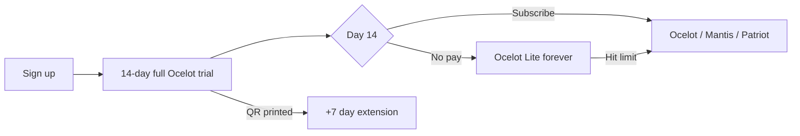

# Features & Pricing Packages — Miki · Barbershop Phase 1

**Use this doc to:** pick what goes in each price package · brief designers/devs · sell to merchants  
**Pricing funnel (start here if confused):** [`pricing-funnel.md`](pricing-funnel.md) — trial → Lite → paid explained plainly  
**Module hub:** [`README.md`](README.md)  
**Product rules:** [`spec.md`](spec.md)  
**Financial model:** [`financial.md`](financial.md) · [`../../financial/ssot.md`](../../financial/ssot.md)

**Legend:** **1A** = MVP launch · **1B** = payment rail phase · **Later** = not Phase 1

**Tier names:** Ocelot (starter) · Mantis (growth) · Patriot (pro) · Arsenal (enterprise)  
**Trial exit ramp:** Ocelot **Lite** — not a signup tier; automatic after 14-day trial if merchant does not subscribe.

---

# Part 1 — Feature catalog

## A. Customer booking (web — no app, no account)

| Feature | What it does | Phase |
| :--- | :--- | :--- |
| Shop QR entry | Customer scans shop QR → booking landing | 1A |
| Guest booking | Nickname + phone only — no signup | 1A |
| Service selection | Pick one or more services from menu | 1A |
| Party / group size | One booking for multiple people (e.g. 3 haircuts) | 1A |
| Date & time slot | Book a slot on the calendar | 1A |
| Booking number | Daily queue # (e.g. #42) | 1A |
| Status page | Unique URL to track booking lifecycle | 1A |
| Now serving display | Show shop’s current serving # on status page | 1A |
| Find my booking | Lookup by phone + date if link lost | 1A |
| Pick your barber | Customer chooses barber + sees their slots | 1A |
| Barber availability | Show **Full** when barber at daily cap | 1A |
| Auto-assign barber | System picks barber when pick-barber is off | 1A |

---

## B. Calendar & scheduling (owner)

| Feature | What it does | Phase |
| :--- | :--- | :--- |
| Per-barber calendar | Separate timetable per chair | 1A |
| Working hours | Set open/close per barber per day | 1A |
| Service duration | Each service has length (e.g. 30 min) | 1A |
| Service buffer | Gap after service (e.g. 5 min cleanup) | 1A |
| Slot generation | Auto-build bookable slots from duration + buffer | 1A |
| Daily cap per barber | Max customers/day — prevent burnout | 1A |
| Walk-in-only blocks | Reserve peak hours for walk-ins only | 1A |
| Master week view | All barbers on one calendar | 1A |
| Reassign barber | Move booking to another barber before cut | 1A |
| Auto no-show | Mark missed after X min late (default 15) | 1A |
| Late override | Manager can still check in late customer | 1A |
| Early arrival rule | Up to 10 min early — wait for turn | 1A |

---

## C. Queue & booking operations (hybrid)

| Feature | What it does | Phase |
| :--- | :--- | :--- |
| Online booking | Customer books via web → slot reserved | 1A |
| Walk-in booking | Staff adds customer on POS | 1A |
| Hybrid coexistence | Online + walk-in same day without conflict | 1A |
| Walk-in queue priority | Walk-ins can pass other walk-ins, not live bookings | 1A |
| Booking lifecycle | BOOKED → ARRIVED → IN_SERVICE → PAID (+ NO_SHOW) | 1A |
| Arrival check-in | Manager marks customer arrived (name verify) | 1A |
| Planned vs actual services | Book haircut online, add beard trim at chair | 1A |
| Overlap warning | Alert if add-on runs into next appointment | 1A |
| Party check-in | Check in whole group or adjust party size | 1A |

---

## D. POS — shared counter

| Feature | What it does | Phase |
| :--- | :--- | :--- |
| Shared terminal | One shop tablet/PC at counter | 1A |
| Barber switcher | Tap barber avatar — actions tied to that person | 1A |
| Today board | Timeline of today’s bookings + walk-ins | 1A |
| Filter by barber | View one chair’s line | 1A |
| Mark arrived | Customer showed up | 1A |
| Mark no-show | Customer missed slot | 1A |
| Cancel booking | Remove before service | 1A |
| Add walk-in | New customer without web booking | 1A |
| Add service at chair | Upsell / change services before pay | 1A |
| Start service | Customer in chair | 1A |
| Complete service | Ready for payment | 1A |
| Void / refund | Owner PIN — reverse transaction | 1A |
| Barber day stats | Quick view: cuts & revenue today | 1A |
| Offline operation | POS works without internet | 1A |
| Offline sync | Queue changes locally → push when online | 1A |

---

## E. Service menu (catalogue)

| Feature | What it does | Phase |
| :--- | :--- | :--- |
| Categories | Group services (Cut, Colour, etc.) | 1A |
| Service name & price | Core catalogue fields | 1A |
| Duration & buffer | Drives calendar slots | 1A |
| Service photo | Optional image on menu | 1A |
| Active / inactive | Hide without deleting | 1A |

---

## F. Payments (HitPay — Phase 1B)

**Tier gates (locked C′ — 2 Jul 2026):** Lite = **capped rail** (RM5k/mo) · **Ocelot+** = **unlimited rail** · **Mantis+** = unlimited + **reconcile dashboard**. See [`../../platform/payment-rails.md`](../../platform/payment-rails.md).

| Feature | What it does | Phase |
| :--- | :--- | :--- |
| Pay after service | No pay-before-cut | 1A |
| Cash | Manual confirm at counter — **exact subtotal, RM0 platform fee** | 1A |
| Own DuitNow QR | Customer pays merchant bank QR — staff confirms — **RM0 platform fee** | 1A |
| **HitPay QR** | Platform DuitNow — amount pre-filled; customer pays **subtotal + 2% service fee** | 1B |
| **HitPay card tap** | Tap-to-pay on phone (no terminal) — same **2% service fee** on customer | 1B |
| Auto-complete on HitPay | Payment webhook → order closed automatically | 1B |
| Customer service fee | **2% of service subtotal** — paid by customer, not merchant | 1B |
| Link payment to booking | Every sale tied to booking record | 1A |

**Example:** RM40 haircut → customer pays **RM40.80** (RM40 + 2%). Merchant receives RM40; platform ~0.8% of base, HitPay ~1.2% (confirm with partner).

See **HitPay checkout flow** in Part 2 and full architecture in [`../../platform/payment-rails.md`](../../platform/payment-rails.md).

---

## G. Receipts

| Feature | What it does | Phase |
| :--- | :--- | :--- |
| Digital receipt page | Itemised receipt via URL | 1A |
| Counter receipt QR | Customer scans at desk to open receipt | 1A |
| Receipt shows actual services | Final list including add-ons | 1A |

*Not Phase 1: SMS receipt · LHDN e-invoice*

---

## H. Reports & analytics (owner)

| Feature | What it does | Phase |
| :--- | :--- | :--- |
| Daily sales summary | Totals for the day | 1A |
| Payment method split | Cash vs own DuitNow vs HitPay | 1A |
| Advanced analytics | Utilisation, no-show rate, per-barber, payment mix, repeat rate | Patriot |
| Per-barber revenue | Income per chair | 1A |
| No-show log | Missed appointments history | 1A |
| Export CSV | Download sales data | 1A |
| Tax document export | CSV/JSON for accountant (not live govt submit) | 1B |
| Reconciliation dashboard | Matched vs unmatched payments | 1B |
| Multi-branch HQ dashboard | Cross-location roll-up | Patriot |

---

## L. Workforce — shifts & commission (not HR)

| Feature | What it does | Phase |
| :--- | :--- | :--- |
| Barber profiles | Name, photo, active — see §I | 1A |
| Per-barber revenue & cut count | Day/week reports | 1A |
| **POS shift (clock-in)** | Tap barber on shared POS → start shift; no extra app | 1B |
| Shift end | Switch barber, manual end, or auto at shop close | 1B |
| Shift summary | Duration + services + revenue per shift | 1B |
| **Commission rules** | % per service, chair rent, hybrid — per barber | 1B |
| **Commission statement** | Period report: gross, shop share, barber share + CSV | 1B |
| **Payroll export (static)** | Worksheet: base + commission + adjustments — for local HR tools | 1B |

*Excluded worldwide: live payroll APIs, payslips, statutory contributions (KWSP/SOCSO/etc.), leave law, GPS clock-in app.*

---

## M. Customers & loyalty

| Feature | What it does | Phase |
| :--- | :--- | :--- |
| Guest booking fields | Nickname + phone per booking | 1A |
| Find my booking | Lookup by phone + date | 1A |
| **Customer profile (auto)** | Built from phone on booking — visit history, spend | **Ocelot+** |
| **Stamp loyalty** | 1 active campaign; stamp on **paid** visit (not booking alone) | **Ocelot+** |
| Stamp progress (merchant) | “3 more visits” view; manual remind v1 | **Ocelot+** |
| **Vouchers / discounts** | Redeemable rewards | Phase 3 |
| Multi-campaign + SMS nudges | Beyond 1 stamp campaign | Add-on |

*Phone at web booking binds profile. Stamp grants on completed payment. **Lite:** no stamps. See [`../../platform/architecture.md`](../../platform/architecture.md).*

---

## N. Tax compliance (receipt vs e-invoice)

| Feature | What it does | Phase |
| :--- | :--- | :--- |
| Digital receipt | Customer-facing URL/QR — not a tax invoice | 1A |
| Tax document capture | Optional buyer name + tax ID at checkout | 1B |
| Tax export | CSV/JSON for accountant | 1B |
| **MyInvois submit (Malaysia)** | Live LHDN validation + UUID | **Add-on** or Patriot |

*Universal receipt everywhere; **country tax adapters** as add-ons. See [`../../platform/architecture.md`](../../platform/architecture.md).*

---

## I. Shop setup & platform

| Feature | What it does | Phase |
| :--- | :--- | :--- |
| Owner account & login | Web access for setup | 1A |
| **Solo vs multi onboarding** | Solo → auto 1 company + 1 outlet; multi → create org then outlets | 1A |
| **Company → outlet model** | Data model from day 1; UI shows 1 / 2 / 5+ locations by tier | 1A |
| Shop / outlet profile | Name, address, contact per outlet | 1A |
| Barber profiles | Name, photo per chair | 1A |
| Shop QR generate/print | For window / counter | 1A |
| TV queue board | Fullscreen browser for shop TV | 1A |
| Subscription & billing | Ocelot / Mantis / Patriot plans | 1A |
| 14-day Ocelot trial | Full paid features; → Lite or subscribe | 1A |
| Plan limit enforcement | Block + upgrade when over limit | 1A |
| Email support | Ocelot+ standard channel | 1A |
| Priority WhatsApp support | Mantis+ included; add-on for Ocelot | Add-on |
| Extra barber (9th+) | Per-chair add-on fee | Add-on |
| Extra POS screen | Second tablet add-on | Add-on |
| **Merchant referral** | Referrer gets **1 month free** after referee pays **1 month** (bill credit) | 1B |

---

## J. Settings & toggles (owner)

| Feature | What it does | Phase |
| :--- | :--- | :--- |
| Allow customer pick barber | ON/OFF | 1A |
| Auto no-show minutes | Default 15 | 1A |
| Early arrival minutes | Default 10 | 1A |
| Show now serving on customer page | ON/OFF | 1A |

---

## K. Not in scope (reference)

| Feature | When |
| :--- | :--- |
| SMS / WhatsApp notifications | Later |
| OTP verification | Later |
| Payroll / payslips / statutory HR | **Never v1** — use local HR tools |
| Separate staff clock-in app | **Never** — shift on POS only |
| Inventory | Later |
| Discounts / vouchers | Phase 3 |
| Booking deposit | Later |
| **Customer feedback / ratings** | **Post-PMF** — private, owner-only when built |
| Customer native app | Not planned |
| F&B table ordering | Phase 2 |

*MyInvois live submit → §N and add-ons. Stamps + CRM on **Ocelot+** — see §M.*

---

# Part 2 — Pricing, trial & packaging

> **Confused by trial vs Lite vs Ocelot?** Read [`pricing-funnel.md`](pricing-funnel.md) first — this section is the detailed reference.

**Product:** Customer QR booking + shared POS for Malaysian barbershops  
**Strategy:** ~15% below StoreHub · high margin on subs · no SMS v1 · no permanent free signup tier  
**Anchor:** StoreHub Starter RM122 · Advanced RM235 · Pro RM471

---

## Trial → Lite → paid flow



| Stage | Duration | What merchant gets |
| :--- | :--- | :--- |
| **Trial** | 14 days (+7 if shop QR printed) | **Full Ocelot** — 4 barbers, calendar, pick-barber, unlimited bookings |
| **Day 15 default** | Forever if no pay | **Ocelot Lite** — shop keeps running; premium features fade |
| **Paid** | Monthly / annual | Ocelot · Mantis · Patriot · Arsenal |

### Trial rules

| Rule | Detail |
| :--- | :--- |
| No card required | Card optional at signup (higher conv, lower signups) |
| 1 trial per phone | 12-month cooldown; no re-trial on same shop |
| Day 10 / 14 emails | “Shop tetap jalan — upgrade for barber 3 + calendar” |
| Customer QR | **Never stops** on Lite — existing status URLs stay live |
| Day 15 downgrade | Barber 3+ frozen · pick-barber off · calendar caps revert |

### Ocelot Lite (post-trial only — not marketed at signup)

| Included | Gated (→ Ocelot) | Gated (→ Mantis) |
| :--- | :--- | :--- |
| 1 barber profile | 2–4 barbers | Reconciliation dashboard |
| 25 online bookings / month | Unlimited | *(Mantis also adds scale — 8 barbers, 2 locations)* |
| Walk-in POS unlimited | Per-barber calendar | |
| Shop QR + status page live | Daily caps · walk-in blocks | |
| Cash + own DuitNow | Pick-your-barber | |
| **HitPay QR + card — RM5k/mo cap** · auto-close | **Unlimited HitPay** · auto-close | |
| Basic offline | Full offline sync · email · CSV · per-barber reports | |
| Community / docs support | | |

**Grandfather rules:**

- **Bookings:** over cap in current month complete; block new online from #26.
- **HitPay GMV:** payments in flight complete; block **new** HitPay checkouts after RM5,000 subtotal in month. Cash / own DuitNow still available.

---

## Package overview

| Tier | Sub-label | Monthly | Annual (2 mo free) | vs StoreHub |
| :--- | :--- | :--- | :--- | :--- |
| **Ocelot Lite** | — | **RM0** | — | Trial exit only |
| **Ocelot** | Starter | **RM109** | **RM1,090/yr** | vs Starter RM122 (−11%) |
| **Mantis** | Growth | **RM199** | **RM1,990/yr** | vs Advanced RM235 (−15%) |
| **Patriot** | Pro | **RM349** | **RM3,490/yr** | vs Pro RM471 (−26%) |
| **Arsenal** | Enterprise | **Contact** | Custom | Multi-franchise |

**Founding barber:** first **50 shops per city** → **RM89/mo locked for life** on Ocelot (verify phone; non-transferable).

**Payment rules:**

| Tier | Integrated rail | Cash / own DuitNow |
| :--- | :--- | :--- |
| **Lite** | HitPay QR + card · **RM5k/mo cap** · customer **+2%** · auto-close · **no reconcile** | Exact subtotal · **RM0** |
| **Ocelot** | HitPay **unlimited** · customer **+2%** · auto-close · **no reconcile** | Exact subtotal · **RM0** |
| **Mantis+** | HitPay **unlimited** · customer **+2%** · auto-close · **reconcile dashboard** | Exact subtotal · **RM0** |

Merchant never pays a processing fee on our rail. Cash and merchant’s own DuitNow are never blocked.

### HitPay checkout flow (Lite cap · Ocelot+ unlimited)

```
Cashier selects services → Subtotal RM40.00
┌─────────────────────────────────────────────────────────┐
│  [HitPay QR]  ← DEFAULT, highlighted                    │
│   Customer scans · pays RM40.80 (RM40 + 2% fee)         │
│   Auto-complete on webhook                              │
├─────────────────────────────────────────────────────────┤
│  [HitPay card tap]                                      │
│   Tap to pay on phone · same 2% on customer             │
├─────────────────────────────────────────────────────────┤
│  [Cash]                                                 │
│   Staff confirms · total RM40.00 · RM0 platform fee     │
├─────────────────────────────────────────────────────────┤
│  [Own DuitNow / bank QR]                                │
│   Staff manually confirms · RM40.00 · not auto-matched  │
└─────────────────────────────────────────────────────────┘
```

**Revenue split (intent):** HitPay ~1.2% of base · platform ~0.8% of base — confirm surcharge support with HitPay before build.

---

## Limits at a glance

| Limit | Lite | Ocelot | Mantis | Patriot |
| :--- | :---: | :---: | :---: | :---: |
| Barber profiles | 1 | 4 | 8 | Unlimited |
| Locations | 1 | 1 | 2 | 5+ |
| POS terminals (shared) | 1 | 1 | 1 (+RM29 extra) | Custom |
| Owner web logins | 1 | 2 | 3 | Unlimited |
| Services in menu | 15 | Unlimited | Unlimited | Unlimited |
| Online bookings / month | 25 | Unlimited | Unlimited | Unlimited |
| HitPay GMV / month (Miki rail) | **RM5,000 cap** | Unlimited | Unlimited | Unlimited |
| Walk-ins on POS | Unlimited | Unlimited | Unlimited | Unlimited |
| Party size (max) | 4 | 6 | 8 | 12 |

---

## Packaging matrix

Use **✓** = included · **—** = not included · **Cap** = limited · **Add** = add-on

### A. Customer booking

| Feature | Lite | Ocelot | Mantis | Patriot |
| :--- | :---: | :---: | :---: | :---: |
| Shop QR entry | ✓ | ✓ | ✓ | ✓ |
| Guest booking | ✓ | ✓ | ✓ | ✓ |
| Service selection | ✓ | ✓ | ✓ | ✓ |
| Party / group size | Cap 4 | Cap 6 | Cap 8 | Cap 12 |
| Date & time slot | ✓ | ✓ | ✓ | ✓ |
| Booking number + status page | ✓ | ✓ | ✓ | ✓ |
| Now serving display | ✓ | ✓ | ✓ | ✓ |
| Find my booking | ✓ | ✓ | ✓ | ✓ |
| Pick your barber | — | ✓ | ✓ | ✓ |
| Barber availability (Full) | — | ✓ | ✓ | ✓ |
| Online bookings / month | Cap 25 | ✓ | ✓ | ✓ |

### B. Calendar & scheduling

| Feature | Lite | Ocelot | Mantis | Patriot |
| :--- | :---: | :---: | :---: | :---: |
| Per-barber calendar | — | ✓ | ✓ | ✓ |
| Working hours | Basic | ✓ | ✓ | ✓ |
| Daily cap per barber | — | ✓ | ✓ | ✓ |
| Walk-in-only blocks | — | ✓ | ✓ | ✓ |
| Master week view | — | ✓ | ✓ | ✓ |
| Reassign barber | — | ✓ | ✓ | ✓ |
| Auto no-show / late override | ✓ | ✓ | ✓ | ✓ |

### C. POS

| Feature | Lite | Ocelot | Mantis | Patriot |
| :--- | :---: | :---: | :---: | :---: |
| Shared terminal + barber switcher | ✓ (1) | ✓ (4) | ✓ (8) | ✓ |
| Filter by barber | — | ✓ | ✓ | ✓ |
| Full booking lifecycle | ✓ | ✓ | ✓ | ✓ |
| Add service at chair | ✓ | ✓ | ✓ | ✓ |
| Offline operation | Basic | Full | Full | Full |

### D. Payments

| Feature | Lite | Ocelot | Mantis | Patriot |
| :--- | :---: | :---: | :---: | :---: |
| Cash + own DuitNow | ✓ | ✓ | ✓ | ✓ |
| HitPay QR + card tap | Cap | ✓ | ✓ | ✓ |
| Auto-complete on HitPay | Cap | ✓ | ✓ | ✓ |
| Reconciliation dashboard | — | — | ✓ | ✓ |

*Cap (Lite only):* **RM5,000 service subtotal / month** through Miki HitPay rail. **Ocelot+** unlimited. Same **2%** customer fee. Reconcile UI from **Mantis+** only.

### E. Service menu

| Feature | Lite | Ocelot | Mantis | Patriot |
| :--- | :---: | :---: | :---: | :---: |
| Categories, price, duration | ✓ | ✓ | ✓ | ✓ |
| Service photo | ✓ | ✓ | ✓ | ✓ |
| Max services | Cap 15 | ✓ | ✓ | ✓ |

### F. Workforce & commission

| Feature | Lite | Ocelot | Mantis | Patriot |
| :--- | :---: | :---: | :---: | :---: |
| Per-barber revenue reports | — | ✓ | ✓ | ✓ |
| POS shift (clock-in on switcher) | — | — | ✓ | ✓ |
| Commission rules + statements | — | — | ✓ | ✓ |
| Payroll export (static worksheet) | — | — | ✓ | ✓ |

### G. Tax & receipts

| Feature | Lite | Ocelot | Mantis | Patriot |
| :--- | :---: | :---: | :---: | :---: |
| Digital receipt | ✓ | ✓ | ✓ | ✓ |
| Tax document export | — | — | ✓ | ✓ |
| MyInvois live submit (MY) | — | Add | Add | ✓ included |

### H. Customers & loyalty

| Feature | Lite | Ocelot | Mantis | Patriot |
| :--- | :---: | :---: | :---: | :---: |
| Guest phone on booking | ✓ | ✓ | ✓ | ✓ |
| Customer profile (auto) | — | ✓ | ✓ | ✓ |
| Stamp loyalty (1 campaign) | — | ✓ | ✓ | ✓ |
| Regulars & Rewards (multi-campaign + SMS) | — | Add | Add | Add |

### I. Organization

| Feature | Lite | Ocelot | Mantis | Patriot |
| :--- | :---: | :---: | :---: | :---: |
| Company + outlet data model | ✓ | ✓ | ✓ | ✓ |
| Outlets visible in UI | 1 | 1 | 2 | 5+ |
| Multi-outlet onboarding | — | — | ✓ | ✓ |

### J. Reports & platform

| Feature | Lite | Ocelot | Mantis | Patriot |
| :--- | :---: | :---: | :---: | :---: |
| Daily sales summary | Basic | ✓ | ✓ | ✓ |
| Per-barber revenue | — | ✓ | ✓ | ✓ |
| Export CSV | — | ✓ | ✓ | ✓ |
| Advanced analytics | — | — | — | ✓ |
| Multi-branch HQ dashboard | — | — | — | ✓ |
| Email support | — | ✓ | ✓ | ✓ |
| Priority WhatsApp | — | Add | ✓ | ✓ |

---

## Package bundles (what you sell)

### Ocelot — RM109/mo ⭐ Most popular
**Tagline:** *Booking QR + POS + calendar — built for barbershop, below StoreHub.*

```
✓ Up to 4 barber profiles
✓ Unlimited online bookings
✓ Per-barber calendar + daily caps
✓ Walk-in-only blocks · pick barber
✓ Per-barber reports + CSV export
✓ Customer profiles + 1 stamp campaign
✓ Full offline sync
✓ HitPay QR + card tap unlimited (customer pays 2% fee — merchant RM0)
✗ Reconciliation dashboard
```

**BM:** *RM109/bulan — booking online + POS kongsi + calendar penuh. Murah dari StoreHub RM122.*

### Mantis — RM199/mo
**Tagline:** *Ocelot + reconcile — stop chasing “dah bayar belum?”*

```
Everything in Ocelot, plus:
✓ Reconciliation dashboard
✓ Up to 8 barbers · 2 locations
✓ POS shift (clock-in on barber tap — no extra app)
✓ Commission rules + barber statements + payroll export
✓ Tax document export for accountant
✗ MyInvois live (add-on RM49) — Patriot includes it
✓ Priority WhatsApp support
```

**BM:** *RM199/bulan — customer bayar 2% untuk QR/tap; cash & QR bank sendiri tetap RM0 untuk kedai.*

### Patriot — RM349/mo
**Tagline:** *Multi-branch command centre for growing chains.*

```
Everything in Mantis, plus:
✓ 5+ locations · unlimited barbers
✓ HQ dashboard + cross-branch reports
✓ **Malaysia MyInvois tax pack included**
✓ Dedicated onboarding
✓ SLA support
```

### Arsenal — Contact
Custom franchise / enterprise · white-label · API · custom SLA.

---

## Upgrade triggers (in-app)

| Event | Prompt |
| :--- | :--- |
| Trial day 10 / 14 | Upgrade to **Ocelot** — keep barber 3 + calendar |
| Add 2nd barber on Lite | **Ocelot** required |
| Hit 25 online bookings (Lite) | **Ocelot** or wait until next month |
| Enable pick-your-barber | **Ocelot** required |
| Set daily cap / walk-in blocks | **Ocelot** required |
| Hit **RM5k** on Miki rail (Lite) | **Ocelot** — unlimited HitPay · or **Mantis** for reconcile |
| End-of-day payment mismatch (Ocelot) | **Mantis** — reconcile dashboard |
| Add 2nd location / 5th barber | **Mantis** |
| Add 5th location / branch | **Patriot** |

---

## Why they upgrade

**Principle:** Merchants upgrade when they **hit a wall in the moment** — not from a pricing page. Show the upgrade prompt **in context**, when pain is felt.

**One-line ladder:**

| Step | What the merchant thinks |
| :--- | :--- |
| **Lite → Ocelot** | *“My shop has 3 barbers — or I hit RM5k on the rail and need unlimited pay.”* |
| **Lite → Mantis** | *“I want reconcile without paying for Ocelot first”* *(solo high-volume edge case)* |
| **Ocelot → Mantis** | *“I need reconcile + more chairs / second location.”* |
| **Mantis → Patriot** | *“I have multiple branches — I need one dashboard.”* |

---

### Lite → Ocelot (RM109)

**Lite = shop still open. Ocelot = run a real multi-chair barbershop.**

| Trigger | What they feel | What Ocelot fixes |
| :--- | :--- | :--- |
| **Day 14 after trial** | Had 3 barbers + calendar — now barber 3 is gone | Keep the setup they already used |
| **Add 2nd / 3rd barber** | Hired Ali — system only shows 1 chair | Up to 4 barbers + barber switcher on POS |
| **25 online bookings hit** | QR full again — customers can’t book | Unlimited online bookings |
| **Customer asks “boleh pilih barber?”** | Shop next door lets you pick | Pick-your-barber + **Full** badges |
| **Peak hours chaos** | Walk-ins eat all online slots | Walk-in-only blocks + daily caps per barber |
| **Owner asks “Ali dapat berapa?”** | No per-chair revenue view | Per-barber reports + CSV export |
| **POS drops offline** | Queue lost when WiFi dies | Full offline sync |
| **Need help** | Stuck on Lite = docs only | Email support |

**Strongest hook (3-chair ICP):** Lite max = **1 barber**. They cannot run their shop without Ocelot — not upsell, but *pay or go back to WhatsApp booking*.

**Psychology:** Loss aversion from 14-day trial. They tasted calendar + 3 barbers; day 15 removes it while **customer QR stays live** — they feel the gap, not betrayal.

**ROI (EN):** *“RM109 = less than 4 haircuts/month. One extra online booking covers it.”*  
**ROI (BM):** *“RM109 — kurang dari 4 potong rambut sebulan. Satu booking extra dah cover.”*

#### In-app copy — Lite → Ocelot

| Moment | EN | BM |
| :--- | :--- | :--- |
| Trial day 10 | Ali’s profile pauses in 4 days — keep full Ocelot for RM109/mo | Profil Ali pause 4 hari lagi — kekal Ocelot penuh RM109/bulan |
| Add barber 2 | Add Ali — upgrade to Ocelot (4 barbers) | Tambah Ali — upgrade Ocelot (4 barber) |
| Booking #26 | Online booking full this month — upgrade or wait till 1st | Booking online penuh bulan ni — upgrade atau tunggu 1hb |
| HitPay cap (Lite) | RM5k rail limit — upgrade **Ocelot** for unlimited pay | Had RM5k rail — upgrade **Ocelot** untuk unlimited |
| Enable pick-barber | Customers pick their barber — Ocelot required | Customer pilih barber — perlu Ocelot |

---

### Lite → Mantis (RM199)

**Most Lite merchants upgrade to Ocelot first for unlimited rail. Mantis is for reconcile + scale.**

| Trigger | What they feel | What Mantis fixes |
| :--- | :--- | :--- |
| **On Ocelot, end-of-day mismatch** | HitPay works but tally is chaos | Reconciliation dashboard |
| **RM5k cap + wants reconcile** | Solo shop, won't pay Ocelot | Rare — reconcile + unlimited in one step |
| **5th–8th barber / 2nd location** | Outgrew Ocelot limits | Scale bundle |

#### In-app copy — Lite → Mantis

| Moment | EN | BM |
| :--- | :--- | :--- |
| HitPay cap (Lite) | RM5k limit — upgrade **Ocelot** for unlimited pay, or **Mantis** for reconcile | Had RM5k — upgrade **Ocelot** unlimited, atau **Mantis** untuk rekod |

---

### Ocelot → Mantis (RM199)

**Ocelot runs the shop and unlimited pay. Mantis adds reconcile + scale.**

| Trigger | What they feel | What Mantis fixes |
| :--- | :--- | :--- |
| **“Dah bayar belum?” at close** | HitPay auto-closes orders but daily tally still messy | Reconciliation dashboard |
| **End-of-day tally mismatch** | Cash + HitPay + bank apps — no single board | Reconciliation dashboard |
| **5th–8th barber / 2nd location** | Outgrew 4 chairs or new branch | 8 barbers · 2 locations |
| **Payroll prep** | Excel every month | Static payroll export (base + commission) |
| **Large parties** | Groups of 6+ | Party size up to 8 |
| **Want WhatsApp support** | Ocelot = email only | Priority WhatsApp included |

**Strongest hook:** Reconcile + scale — not “turn on payments.” Ocelot already has unlimited HitPay.

**Psychology:** *“Payments work — I need one number at close and room to grow.”*

**ROI (EN):** *“If auto-reconcile saves 30 min/day, RM199 is cheap for a second pair of hands.”*  
**ROI (BM):** *“Jimat 30 minit sehari check payment — RM199 berbaloi.”*

#### In-app copy — Ocelot → Mantis

| Moment | EN | BM |
| :--- | :--- | :--- |
| End-of-day unmatched | 3 unmatched payments today — Mantis auto-reconciles | 3 payment tak match hari ni — Mantis auto rekod |
| Checkout screen | Tired of checking bank app? Try Mantis | Penat check app bank? Cuba Mantis |
| Add 5th barber | 5 chairs — upgrade to Mantis (8 barbers) | 5 kerusi — upgrade Mantis (8 barber) |

---

### Mantis → Patriot (RM349)

| Trigger | What they feel | What Patriot fixes |
| :--- | :--- | :--- |
| **3+ locations** | Each branch is a silo | HQ dashboard + cross-branch reports |
| **Franchise / partner shops** | Need central visibility | Multi-branch command centre |
| **Compliance / scale** | Outgrown 2-location cap | Unlimited barbers · 5+ locations · SLA |

*Patriot is Phase 1 aspirational tier — expect volume from Year 2+.*

---

### Who stays on Lite (acceptable)

**Profile:** 1-chair solo · &lt;25 online bookings/mo · walk-in heavy.

**Strategy:** Do not force upgrade. Low COGS (~RM4/mo). May refer a 3-chair shop later. Monitor Lite % of active — target **&lt;45% Y1**.

**Do not optimize for Lite conversions.** Optimize for **3-chair ICP → Ocelot** at trial end and barber-cap wall.

---

## Add-ons (optional)

| Add-on | Price | Notes |
| :--- | :--- | :--- |
| **Tax Compliance — Malaysia (MyInvois)** | RM49/mo | Live LHDN submit; **included on Patriot** |
| **Regulars & Rewards** | RM49/mo | Multi-campaign stamps + SMS nudges; vouchers Phase 3 |
| Extra barber (9th+) | RM19/mo each | Mantis+ |
| Extra POS screen | RM29/mo | Second tablet |
| Priority WhatsApp (Ocelot only) | RM99/mo | Included on Mantis+ |
| Extra owner login | RM15/mo | Accountant view — Phase 1B |

*Future markets: **Tax Compliance — Singapore**, etc. — same add-on pattern, new adapter.*

---

## vs StoreHub

| | Ocelot RM109 | Mantis RM199 | StoreHub |
| :--- | :--- | :--- | :--- |
| vs their tier | Starter RM122 | Advanced RM235 | Pro RM471 |
| Built for barbershop | ✅ | ✅ | Generic F&B |
| Customer QR booking | ✅ | ✅ | Partial |
| Per-barber calendar + cap | ✅ | ✅ | Varies |
| Shared 1-machine POS | ✅ | ✅ | Multi-device |
| HitPay auto-reconcile | — | ✅ | Varies |
| Hardware bundle required | ❌ BYOD | ❌ BYOD | Often RM2k+ |
| E-invoice | Add-on / Patriot | Patriot includes MY; Ocelot/Mantis use receipt + export |

---

## Pricing psychology (merchant-facing)

| Tactic | Copy |
| :--- | :--- |
| **Anchor** | “StoreHub RM122 — kita RM109. Jimat RM156/tahun.” |
| **ROI** | “Satu customer extra sebulan = RM25–40. Sistem ni RM109.” |
| **Daily cost** | “RM3.60 sehari — kurang dari satu beard trim.” |
| **Trial** | “14 hari percuma — full Ocelot. QR customer tak putus lepas trial.” |
| **Decoy** | Mantis RM199 makes Ocelot RM109 feel like the smart choice |
| **FOMO** | Founding barber RM89/mo — first 50 shops per city |
| **Annual** | “Bayar 10 bulan, dapat 12 — jimat 2 bulan” |

---

## Economics (why these prices)

| Tier | Sub revenue | ~Platform COGS/shop | Gross margin |
| :--- | :--- | :--- | :--- |
| Lite | RM0 | ~RM4 | subsidised (cap enforced) |
| Ocelot | RM109 | ~RM5 | **~95%** |
| Mantis | RM199 | ~RM5 | **~97%** |
| Patriot | RM349 | ~RM6 | **~98%** |

**80/20 rule:** COGS ≤ 20% of MRR_saas · alert if trial→paid < 22% for 2 consecutive months · max ~5 Lite users per paying user at steady state.

---

## Decision log

| Date | Decision |
| :--- | :--- |
| 2026-06 | Solo / Shop / Shop + Pay barbershop tiers |
| 2026-06-25 | **Ocelot / Mantis / Patriot / Arsenal** — StoreHub-gap pricing (109/199/349) |
| 2026-06-25 | **No permanent free signup** — 14-day full trial → Ocelot Lite exit ramp |
| 2026-06-25 | Lite: 1 barber · 25 bookings/mo · QR stays live |
| 2026-07-02 | **Option C′** — Lite HitPay **RM5k cap**; **Ocelot+ unlimited** rail (no reconcile); **Mantis+** adds reconcile. Paid tiers beat free on payments. |
| 2026-06-25 | **HitPay on Mantis+** — 2% customer fee (customer pays); cash/own QR RM0 |
| 2026-06-25 | Founding barber RM89/mo — 50 shops/city cap |
| 2026-06-25 | **Stamps on Ocelot+** — paid visit triggers; 1 campaign; Lite excluded |
| 2026-06-25 | **Org model** — Company → Outlet; solo vs multi onboarding |
| 2026-06-25 | **Payroll export** static worksheet on Mantis — no statutory APIs |
| 2026-06-25 | **Feedback/ratings** deferred post-PMF; private owner-only when built |
| 2026-06-25 | **Referral** — 1 month free after referee pays 1 month |
| 2026-06-25 | **Vouchers** Phase 3; **advanced analytics** on Patriot |
| 2026-06-27 | **Why they upgrade** — pain-based upgrade moments + in-app copy (EN/BM) |
| 2026-06-27 | **Platform architecture** — universal core + tax/workforce adapters ([`../../platform/architecture.md`](../../platform/architecture.md)) |
| 2026-06-27 | **MyInvois = add-on RM49** (included Patriot); receipt + export on Mantis |
| 2026-06-27 | **Workforce** — POS shift + commission on Mantis; no payroll APIs |
| 2026-06-27 | **Regulars & Rewards** add-on — multi-campaign + SMS; base stamps on Ocelot |

---

*Update [`../planning/initial-brd.md`](../planning/initial-brd.md) when marketing narrative changes.*
