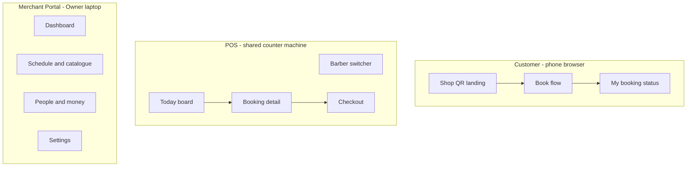

# UI Specification — Miki · Barbershop Phase 1

**Platform:** Miki · **Module:** Barbershop  
**Module hub:** [`README.md`](README.md)  
**Product spec:** [`spec.md`](spec.md)  
**Motion prototype:** [`../../design/motion-prototype.md`](../../design/motion-prototype.md)  
**Engineering modules:** [`../../product/engineering-modules.md`](../../product/engineering-modules.md)

This document combines **screen specifications** for the three surfaces: Customer web, Shared POS, and Owner web (Merchant Portal).

**Merchant Portal IA / nav / module map SSOT:** [`../../platform/Miki Merchant Portal — Designer IA Brief.md`](../../platform/Miki%20Merchant%20Portal%20%E2%80%94%20Designer%20IA%20Brief.md) — do not maintain a parallel Owner sidebar tree in this file.

---

# Part 0 — Information Architecture

**Spec:** [`spec.md`](spec.md)  
**Merchant Portal nav SSOT:** [Designer IA Brief](../../platform/Miki%20Merchant%20Portal%20%E2%80%94%20Designer%20IA%20Brief.md)

---

## Three surfaces



| Code | Surface | Device | Login |
| :--- | :--- | :--- | :--- |
| **C-** | Customer web | Customer phone | None (booking token in URL) |
| **P-** | POS | 1 shop tablet/PC | Shop session + barber switch |
| **O-** | Merchant Portal (Owner role) | Laptop | Owner account |

---

## Screen ID format

`{surface}-{module}-{seq}` — e.g. `C-06-03` = Customer, module booking, screen 3.

---

## Global navigation

### Customer web (no tab bar — linear + status page)
```
QR Landing → Book (multi-step) → Confirmation + bookmark URL
                                    ↓
                            Status page (poll/WebSocket)
```

### POS (single machine)
```
Login → Barber picker (persistent header)
     → Bottom pill: Today | Walk-in | Calendar peek | More
Today → Booking card → Detail → [Add service] → Start → Complete → Pay
More → Search · My day · End session
```
**IA detail:** [`../../design/staff-pos-ia.md`](../../design/staff-pos-ia.md) §3 Bottom nav pill.

### Merchant Portal (Owner sidebar)

**SSOT:** [`Miki Merchant Portal — Designer IA Brief.md`](../../platform/Miki%20Merchant%20Portal%20%E2%80%94%20Designer%20IA%20Brief.md) §4.  
Do not duplicate the left-rail / module map here. Part 3 below remains O-xx **screen** specs (to be expanded to match the brief over time).

---

## Module map → screens

| Module | Customer | POS | Owner (Merchant Portal) |
| :--- | :--- | :--- | :--- |
| MOD-01 Auth | — | P-01 | O-01 |
| MOD-05 Menu | C-05 | P-05 | O-05 |
| MOD-06 Queue/Book | C-06 | P-06 | O-06 |
| MOD-07 Pay | C-07 | P-07 | — (Payments oversight in portal IA; checkout on POS) |
| MOD-08 Receipt | C-08 | P-08 | — |
| MOD-09 Reports | — | P-09 | O-09 |
| MOD-10 Offline | — | P-10 | — |

Full Merchant Portal module list (People, Inventory, Accounting, etc.): see Designer IA Brief. Detail: [`#part-1--customer-web`](#part-1--customer-web), [`#part-2--pos-shared-counter`](#part-2--pos-shared-counter), [`#part-3--owner-web`](#part-3--owner-web).

---

# Part 1 — Customer Web

**Audience:** Customer (no account)  
**Device:** Mobile browser  
**Labels:** EN primary · BM in parentheses where customer-facing

---

## C-01 Auth & entry

### C-01-01 Shop QR landing
| Field | Detail |
| :--- | :--- |
| **Entry** | Scan printed QR at shop |
| **Purpose** | Identify shop; start book or view board |
| **Components** | Shop name, logo, hours today, “Book now” CTA, “Now serving #N” ticker |
| **Actions** | Book now → C-06 flow · View my booking → C-01-02 |
| **States** | Shop closed (hours), offline (cached hours) |
| **BM** | *Tempah sekarang* · *Sedang layan #N* |

### C-01-02 Retrieve booking
| Field | Detail |
| :--- | :--- |
| **Entry** | Landing “I have a booking” |
| **Purpose** | No account — find by phone + date |
| **Components** | Phone input, date picker (default today), Submit |
| **Actions** | Match → C-06-08 Status page |
| **Errors** | Not found, multiple → pick one |
| **PDPA** | One-line consent under phone field |

---

## C-05 Services (booking step)

### C-05-01 Select services
| Field | Detail |
| :--- | :--- |
| **Entry** | From C-01-01 Book |
| **Purpose** | Pick planned services per person + party size |
| **Components** | Party size stepper (1–6), **per-person tabs** when party > 1, category list, service cards (name, price, duration), optional guest name per tab |
| **Actions** | Next → C-06 barber/time (disabled until all members have ≥1 service) |
| **Rules** | Total duration hint: “~75 min for 3 people”; one booking · one queue # |
| **Penpot** | `CW — Select Services`, `CW — Services Per Person` |
| **States** | Empty menu (shop misconfigured) |

**Party > 1 flow:** Customer switches tabs (Person 1, 2, 3…) and picks services for each. Does **not** pick barber per person — see [`spec.md`](spec.md) §2a.

---

## C-06 Booking & calendar

### C-06-01 Pick barber (if enabled)
| Field | Detail |
| :--- | :--- |
| **Entry** | After services |
| **Purpose** | Choose barber or “Anyone available” |
| **Components** | Barber cards: photo, name, **Full** badge, next free slot time |
| **Skip** | If `allow_customer_pick_barber` OFF → auto C-06-02 |
| **BM** | *Penuh* |

### C-06-02 Pick date
| Field | Detail |
| :--- | :--- |
| **Components** | Horizontal date strip (7–14 days), disabled past days |
| **Actions** | Select day → C-06-03 |

### C-06-03 Pick time slot
| Field | Detail |
| :--- | :--- |
| **Components** | Grid of slots (respect duration+buffer), greyed = taken / walk-in-only / **too short for party** |
| **Party rule** | Slots shorter than **sum of member durations** are greyed; hint: “Party needs 75 min” |
| **Actions** | Select slot → C-06-04 |
| **Empty** | “Fully booked — try another barber or date” |
| **Penpot** | `CW — Pick Date & Time` (party slot hint) |

### C-06-04 Your details
| Field | Detail |
| :--- | :--- |
| **Components** | Nickname (required), phone (required), notes optional |
| **Validation** | Phone MY format; soft cap 1 active booking/phone/day |
| **Actions** | Confirm → C-06-05 |

### C-06-05 Review & confirm
| Field | Detail |
| :--- | :--- |
| **Components** | Summary: services, party size, barber, date/time, est. duration, total price |
| **Party** | **Per-person line items** (name · services · price) + party total; “one arrival time” |
| **Actions** | Confirm booking → C-06-06 (morph button — see motion prototype) |
| **Logic** | Server atomic slot lock for **full party duration**; race → “Slot just taken” |
| **Penpot** | `CW — Review Booking`, `CW — Review Party` |

### C-06-06 Confirmation
| Field | Detail |
| :--- | :--- |
| **Components** | **Queue #42** (number barrel roll), barber, datetime, “Save this page” prompt |
| **Party** | “Party of 3” · single #42 for whole group |
| **Components** | Copy link button, bookmark instruction |
| **No SMS v1** | URL contains `booking_token` |
| **Actions** | View status → C-06-08 |

### C-06-07 Now serving board (optional tab)
| Field | Detail |
| :--- | :--- |
| **Purpose** | Shop-wide + per-barber now serving |
| **Components** | Large # display, barber columns if 3 chairs |
| **Refresh** | Poll 10s or WebSocket |

### C-06-08 Booking status (living page)
| Field | Detail |
| :--- | :--- |
| **Entry** | Confirmation URL or retrieve flow |
| **Components** | Status chip, queue #, barber name, planned services, slot time |
| **Components** | “Now serving: #40” (shop), your #42 |
| **Party** | Per-member progress rows (waiting / in chair / done); “2 of 3 in chair” |
| **States** | BOOKED, ARRIVED, IN_SERVICE, PAID, NO_SHOW |
| **NO_SHOW** | Message + “Book again” → C-01-01 |
| **PAID** | Link to C-08 receipt |
| **Note** | No push — user refreshes or keeps page open |
| **Penpot** | `CW — Booking Status`, `CW — Party Status` |

---

## C-07 Payment (customer passive)

*Customer does not pay on web in v1 — payment at counter.*

### C-07-01 Payment pending (optional on status page)
| Field | Detail |
| :--- | :--- |
| **When** | IN_SERVICE → COMPLETED, before PAID |
| **Copy** | “Please pay at counter” |

---

## C-08 Receipt

### C-08-01 Digital receipt
| Field | Detail |
| :--- | :--- |
| **Entry** | Status page after PAID or counter receipt QR |
| **Components** | Shop name, date, services (actual), total, payment method, barber name |
| **No** | LHDN e-invoice |
| **Actions** | Share / screenshot |

---

## Customer flow diagram

```
C-01-01 Landing
    → C-05-01 Services (+ party size, per-person tabs if party > 1)
    → C-06-01 Barber? (flag) — one barber for whole party
    → C-06-02 Date
    → C-06-03 Time (party duration blocks slot)
    → C-06-04 Details (nickname + phone; optional per-guest names)
    → C-06-05 Review (per-person line items if party)
    → C-06-06 Confirmed (# + URL)
    → C-06-08 Status (lifecycle; party progress if party)
    → C-08-01 Receipt (when paid)
```

**Phase 1A screen count:** 14 core + party variants + 4 state variants ≈ **22 frames**

---

## Design notes

- Thumb-zone CTAs bottom fixed  
- High contrast for queue # (elderly customers)  
- BM toggle on landing (Phase 1B) — English first OK for v1  
- Max width 430px centered

---

# Part 2 — POS (Shared Counter)

**Audience:** Barber / owner operating **one shared machine**  
**Device:** Tablet or PC at counter (web app or RN — designer choice; optimise landscape)  
**UI design authority:** [`../../design/staff-pos-ui-design.md`](../../design/staff-pos-ui-design.md) — personality, layout, components, status language, composition rules.  
**IA (screen map):** [`../../design/staff-pos-ia.md`](../../design/staff-pos-ia.md) — screen-by-screen components & layouts.

---

## P-01 Session

### P-01-01 Shop login
| Field | Detail |
| :--- | :--- |
| **Purpose** | Start terminal session (1 device registration) |
| **Components** | Email/password or stay logged in |
| **After** | P-01-02 Barber switcher |

### P-01-02 Barber switcher (persistent header)
| Field | Detail |
| :--- | :--- |
| **Purpose** | Attribute actions to Ali / Siti / Ben |
| **Components** | 3 avatars, active highlight, “Manager” if owner |
| **Behaviour** | Tap to switch — no full logout |
| **Audit** | All actions store `acting_barber_id` |

---

## P-06 Today board (core)

### P-06-01 Today timeline
| Field | Detail |
| :--- | :--- |
| **Purpose** | All bookings + walk-ins for selected day |
| **Components** | Time axis, cards colour-coded: Online / Walk-in / Arrived / In chair / Done |
| **Components** | Filter: All barbers | Ali | Siti | Ben |
| **Actions** | Tap card → P-06-03 · FAB → P-06-02 Walk-in |
| **Offline** | P-10 banner; data from cache |

### P-06-02 New walk-in
| Field | Detail |
| :--- | :--- |
| **Purpose** | Add walk-in without customer phone flow |
| **Components** | Name, phone optional, services, barber (or next free), walk-in slot picker |
| **Rules** | Cannot occupy booked slot; can use walk-in-only blocks |
| **Actions** | Create → appears on board |

### P-06-03 Booking detail
| Field | Detail |
| :--- | :--- |
| **Purpose** | Single booking control panel |
| **Shows** | #, nickname, phone (tap to call), planned services, barber, time, status |
| **Actions** | **Mark arrived** · **No-show** · **Cancel** · **Reassign barber** (if not IN_SERVICE) |
| **Actions** | **Add service** → P-06-04 · **Start cut** · **Complete** → P-07 |
| **Party** | See P-06-07 / P-06-08 for multi-member bookings |

### P-06-07 Party check-in
| Field | Detail |
| :--- | :--- |
| **Entry** | Tap party booking on today board (#42 · Party of 3) |
| **Purpose** | Confirm who actually arrived before assigning chairs |
| **Components** | Member list with **Here / No-show** toggle per person; “Booked 3 · adjust before assigning” |
| **Rules** | No-shows excluded from bill; one queue # retained for arrived members |
| **Actions** | Confirm arrival → P-06-08 Assign chairs |
| **Penpot** | `POS — Party Check-in` |

### P-06-08 Party assign & parallel cuts
| Field | Detail |
| :--- | :--- |
| **Purpose** | Split party across barbers; run cuts in parallel |
| **Components** | Chair view (Ali / Siti / Ben), busy banner (“Ali finishing #40”), per-member **Start / Complete** |
| **Rules** | One active cut per barber; members may be in chair simultaneously; **Start all ready** shortcut |
| **Mid-flow** | Can mark waiting guest no-show before payment |
| **Actions** | All arrived members complete → P-07-01 (party line items) |
| **Penpot** | `POS — Party Assign` |
| **Motion** | [`motion-prototype.md`](../../design/motion-prototype.md) · `PosPartyAssign.tsx` |

### P-06-04 Add / change services (add-on)
| Field | Detail |
| :--- | :--- |
| **Purpose** | Beard trim etc. at chair |
| **Components** | Planned list + “Add service” catalogue search |
| **Warning** | Yellow banner if extends into next booking |
| **Actions** | Save → updates `actual_services` on booking |

### P-06-05 Reassign barber
| Field | Detail |
| :--- | :--- |
| **When** | Before IN_SERVICE |
| **Components** | Barber list with availability / Full |
| **Actions** | Confirm → updates customer status page on sync |

### P-06-06 No-show confirm
| Field | Detail |
| :--- | :--- |
| **Trigger** | Manual or auto 15 min late indicator on card |
| **Components** | “Mark no-show?” · Override “They just arrived” |
| **Effect** | Slot freed; status NO_SHOW on customer web |

---

## P-07 Checkout & payment

### P-07-01 Payment screen
| Field | Detail |
| :--- | :--- |
| **Entry** | After **Complete** on booking (solo or all party members done) |
| **Shows** | Actual services, subtotal, linked booking # |
| **Party** | Line items: **name · service · barber · price** per arrived member; no-shows omitted |
| **Methods** | **[HitPay QR]** (highlight) · **[HitPay card]** · Cash · Own DuitNow |
| **Phase 1A** | Cash + Own DuitNow only |
| **Phase 1B** | HitPay — show subtotal + 2% service fee + total |
| **Actions** | Complete payment → P-08 (morph button on confirm — motion prototype) |
| **Penpot** | `POS — Payment (P-07-01)`, `POS — Party Payment` |

### P-07-02 HitPay (Phase 1B)
| Field | Detail |
| :--- | :--- |
| **Components** | Line items · Subtotal · Service fee (2%) · **Total** |
| **Example (solo)** | RM 55.00 + RM 1.10 fee = **RM 56.10** paid by customer |
| **Example (party)** | 2 of 3 arrived: RM 80.00 + RM 1.60 = **RM 81.60** |
| **QR mode** | Large QR, polling spinner, “Waiting for payment…” |
| **Card mode** | Tap card on HitPay terminal; “Hold device near terminal…” |
| **On paid** | Auto P-08 + receipt link / counter QR |
| **Penpot** | `POS — HitPay (P-07-02)`, `POS — HitPay · Card`, `POS — HitPay · Party` |
| **Rules** | Merchant receives full subtotal; 2% borne by customer ([`spec.md`](spec.md) §8) |

---

## P-08 Receipt handoff

### P-08-01 Payment success
| Field | Detail |
| :--- | :--- |
| **Components** | Total paid, method, receipt link QR for customer to scan |
| **Motion** | Receipt printer slide + confetti on success ([`ReceiptPrinter.tsx`](../../../prototype/motion/src/components/ReceiptPrinter.tsx)) |
| **Actions** | Show receipt QR · New walk-in · Done |
| **Backend** | Link to C-08-01 (no SMS v1) |
| **Penpot** | `POS — Payment Success (P-08-01)` |

---

## P-09 Quick stats (drawer)

### P-09-01 My day (barber)
| Field | Detail |
| :--- | :--- |
| **Shows** | Cuts today, revenue today (acting barber) |
| **Access** | Header menu |

---

## P-10 Offline

### P-10-01 Offline banner (global)
| Field | Detail |
| :--- | :--- |
| **Copy** | “Offline — saving locally (12 pending)” |
| **Behaviour** | All P-06 actions queue; sync icon when back |

---

## POS flow (happy path — solo)

```
P-01-02 Switch barber (Ali)
  → P-06-01 See 2:00pm booking #42
  → P-06-03 Mark arrived
  → P-06-04 Add beard trim
  → Start cut → IN_SERVICE
  → Complete → P-07-01 Pay (HitPay)
  → P-08-01 Receipt link / counter QR shown
```

## POS flow (happy path — party)

```
P-06-01 Tap #42 · Party of 3
  → P-06-07 Who arrived? (2 Here, 1 No-show)
  → P-06-08 Assign chairs · parallel Start/Complete per member
  → P-07-01 Collect payment (2 line items, RM 80)
  → P-07-02 HitPay QR or Card (RM 81.60 incl. 2%) OR Cash/DuitNow (RM 80 exact)
  → P-08-01 Receipt + counter QR
```

**Phase 1A POS frames:** ~20 + party + HitPay variants ≈ **26 frames**

---

## Design notes

- **Landscape first** — timeline left, detail right on wide screens  
- Portrait: board list → full-screen detail  
- Touch targets 48dp+ for wet/gloomy hands  
- Status colours: Waiting=blue, Arrived=amber, In chair=purple, Paid=green, No-show=grey

---

# Part 3 — Owner Web (Merchant Portal)

**Audience:** Shop owner (often also a barber) — **Owner** role on **Merchant Portal**  
**Device:** Desktop / laptop (responsive tablet OK)  
**IA / nav SSOT:** [`../../platform/Miki Merchant Portal — Designer IA Brief.md`](../../platform/Miki%20Merchant%20Portal%20%E2%80%94%20Designer%20IA%20Brief.md)

Screen frames below are the current O-xx set (Phase 1A-oriented). Expand over time to match the Designer IA Brief (Inventory, People/Roster/Leave/Payroll, Accounting, etc.).

---

## O-01 Auth & onboarding

### O-01-01 Sign up / Login
Standard merchant auth (see MOD-01).

### O-01-02 Onboarding wizard
| Step | Screen |
| :--- | :--- |
| 1 | Shop name, address, phone |
| 2 | Add barbers (Lite: 1 · Ocelot: up to 4 · Mantis: up to 8) |
| 3 | Add services + duration + buffer |
| 4 | Set hours + daily caps per barber |
| 5 | Plan picker (trial) |

---

## O-05 Services & catalogue

### O-05-01 Service list
CRUD services: name, price, duration min, buffer min, category.

### O-05-02 Service edit
Photo optional; active toggle.

---

## O-06 Calendar & capacity

### O-06-01 Master calendar
| Field | Detail |
| :--- | :--- |
| **View** | Week view, 3 barber columns (Ali | Siti | Ben) |
| **Shows** | Bookings, walk-in blocks, walk-ins |
| **Actions** | Click slot → booking detail · drag reassign (Phase 1B) |

### O-06-02 Barber settings
| Field | Detail |
| :--- | :--- |
| **Per barber** | Name, photo, working hours template |
| **Cap** | `max_bookings_per_day` (burnout) |
| **Toggle** | Active / on leave |

### O-06-03 Walk-in slot blocks
| Field | Detail |
| :--- | :--- |
| **Purpose** | Paint “walk-in only” on timetable |
| **UI** | Drag block on calendar · repeat weekly |
| **Example** | Sat 12–2pm peak walk-in only |

### O-06-04 Shop booking rules
| Field | Detail |
| :--- | :--- |
| **Flags** | Allow customer pick barber (ON/OFF) |
| **Flags** | **Party bookings** (ON/OFF) — one queue #, per-person services, sum-of-durations slot block |
| **Flags** | Auto no-show minutes (default 15) |
| **Flags** | Early arrival grace (10) |
| **Penpot** | `MP — Booking Rules` |

### O-06-05 QR codes
| Field | Detail |
| :--- | :--- |
| **Purpose** | Print shop QR (customer landing), counter receipt QR |
| **Components** | Shop QR card + Print · Counter retrieve QR + Print |
| **Penpot** | `MP — QR Codes` |

---

## O-09 Reports

### O-09-01 Dashboard
Today: bookings, walk-ins, revenue, no-shows.

### O-09-02 Per-barber revenue
| Field | Detail |
| :--- | :--- |
| **Components** | Table: barber, cuts, gross, avg ticket |
| **Actions** | Export CSV → O-09-03 |
| **Penpot** | `MP — Reports` |

### O-09-03 Export
CSV date range.

---

## O-settings Billing & staff

### O-02-01 Billing
Plan, usage, upgrade (from [`../planning/initial-brd.md`](../planning/initial-brd.md)).

### O-04-01 Staff / barber accounts
Link login to barber profile for POS switcher (optional password per barber for switch PIN).

---

## Owner screen count

~**17 frames** for Phase 1A setup + calendar + reports + booking rules + QR.

---

## Penpot frame index (barbershop)

**Draft page:** `‎ ‎ ‎ Customer Web App` — flow validation, frozen  
**Hi-fi page:** `Customer Web · Hi-Fi` — **motion prototype skin** (matches `prototype/motion/` BookingFlow), component strip (`DS — Components`)

**Visual system (motion prototype):**

| Token | Value | Notes |
| :--- | :--- | :--- |
| Phone bg | `#F9F9F8` | Warm off-white |
| Screen card | white · `rounded-16` · border 6% | Single card — no header/CTA strips |
| Card padding | **24px** | Inner content width **294px** |
| Progress | 5 × **6px** segment bars · 24px gap below | Above card; active = `#38CE87` |
| Primary CTA | `#38CE87` · `rounded-12` · 52px · ink text | Matches MorphButton idle |
| Selected card | green 10% fill · green 50% border | Services, barbers, slots |
| Typography | Instrument Sans headlines · IBM Plex body | Kicker `#1A7A4C` |

**Hi-fi grid (Customer Web · Hi-Fi):**

Spacing matches coded prototype (`BookingFlow.tsx`): **24px** card padding · **294px** content · **16px** section gap · **12px** radius on cards/buttons · **16px** radius on screen card.

**Layout (v2 — rebuilt Jul 2026):**

```
Phone frame (flex column · pad 24 · gap 24)
├── Progress bars        fill × fix 6px
├── Screen card          fill × fix 580px (flow) or hug (status)
│   ├── header / content   gap 12 · pad 24
│   ├── CTA spacer         fill (pushes button down inside card)
│   └── Button             fill × fix 52px
└── Frame spacer           fill (absorbs viewport — no white void inside card)
```

- **Screen card** is **580px** on booking-flow screens (matches `min-h-[580px]` in `BookingFlow.tsx`); status/edge screens hug content (~420px).
- **Service cards** 76px · stepper 52px · person tabs 40px · explicit `resize()` on all interactive rows.
- All flex children appended via `appendChild` then `layoutChild` — never set `layoutChild` before append.
- POS / Merchant / Admin: **sidebar 240px fix** + **main fill**; panel cards explicit width×height; body **flex row** for two-column layouts.

| Row | y | Frames |
| :--- | :--- | :--- |
| Components | 0 (left col) | `DS — Components` |
| Happy path · entry | 0 | Landing, Select Services, Services Per Person |
| Happy path · schedule | 900 | Pick Barber, Date & Time, Your Details |
| Happy path · confirm | 1800 | Review Booking, Review Party, Confirmed |
| Status / receipt | 2700 | Booking Status, Party Status, Receipt |
| **Edge states** | **3600** | Retrieve, Booking Not Found, Shop Closed, Shop Offline |
| **Edge states · cont.** | **4500** | Slot Taken, No-show, Payment Pending |

**Hi-fi annotations:** Motion behaviour documented in [`motion-prototype.md`](../../design/motion-prototype.md) and coded in `prototype/motion/` — Penpot hi-fi uses static frames only (no Motion Note chips; cleaner handoff).

**POS · Hi-Fi grid** (1280×800 · draft `‎ ‎ ‎ POS` frozen):

| Row | y | Frames |
| :--- | :--- | :--- |
| Core | 0 | Shop Login, Today Board, Today Board · Party #42 |
| Party flow | 880 | Party Check-in, Party Assign, Party Payment |
| Payment | 1760 | Payment (P-07-01), Payment Success, HitPay QR |
| HitPay variants | 2640 | HitPay · Card, HitPay · Party, HitPay · Timeout |

**Merchant · Hi-Fi grid** (1440×900 · draft `‎ ‎ ‎ Merchant Portal` frozen):

| Row | y | Frames |
| :--- | :--- | :--- |
| Auth + core | 0 | Login, Calendar, Services |
| Settings · capacity | 960 | Walk-in Blocks, Booking Rules, QR Codes |
| People · onboarding | 1920 | Reports, Barbers, Onboarding Wizard |

Layout: **flex row** shell — sidebar 240px (fix) + main (fill) · page header + white cards · motion prototype tokens.

Draft `MP — *` frames not yet in hi-fi (add when needed): Shell Layout, Billing, Customers, Service Edit drawer, Plan Picker.

Draft grid (unchanged):

| Row | y | Frames |
| :--- | :--- | :--- |
| Happy path · book | 0 | Landing, Select Services, Pick Barber, Date & Time, Retrieve |
| Happy path · confirm | 900 | Details, Review, Confirmed, Status, Receipt |
| Party variants | 1800 | Services Per Person, Review Party, Party Status, Booking Not Found |
| Error / edge | 2700 | Shop Closed, Offline, Slot Taken, No-show, Payment Pending |

| Page | Key frames |
| :--- | :--- |
| **Customer Web · Hi-Fi** | `CW-Hi — *` (see hi-fi grid) |
| **POS · Hi-Fi** | `POS-Hi — *` — 1280×800 · motion prototype skin (see below) |
| **Merchant · Hi-Fi** | `MP-Hi — *` — 1440×900 · owner web · flex sidebar shell (see below) |
| **Admin · Hi-Fi** | `AP-Hi — *` — 1440×900 · platform internal · [`Miki Admin Portal BRD.md`](../../platform/Miki%20Admin%20Portal%20BRD.md) · [`user flow`](../../platform/Miki%20admin%20portal%20user%20flow.md) |
| **Customer Web App** (draft) | CW — * (see draft grid) |
| **POS** | Today Board, **Today Board · Party #42**, Party Check-in, Party Assign, Party Payment, HitPay (P-07-02), HitPay · Card, HitPay · Party, **HitPay · Timeout** |
| **Merchant Portal** | Shell Layout, Calendar, **Walk-in Blocks**, Services, Booking Rules, QR Codes, Reports |
| **Admin Portal** (platform) | `AP — Dashboard`, `AP — Merchant Detail`, `AP — Subscriptions` · hi-fi: **Admin · Hi-Fi** |
| **Motion** | Number Barrel, Morph Button, Receipt, Card Expand, Party Flow, Springs SSOT |

Coded reference: [`motion-prototype.md`](../../design/motion-prototype.md)

---

## Design notes

- Calendar is the **hero** screen post-onboarding  
- Cap sliders with helper: “Ali usually takes 12 cuts/day”  
- Mobile web read-only calendar OK for owner on phone
