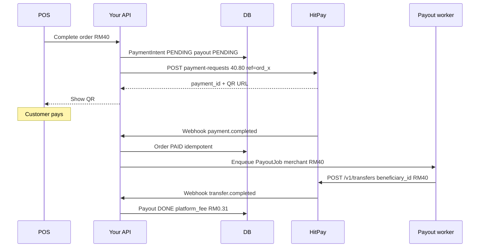
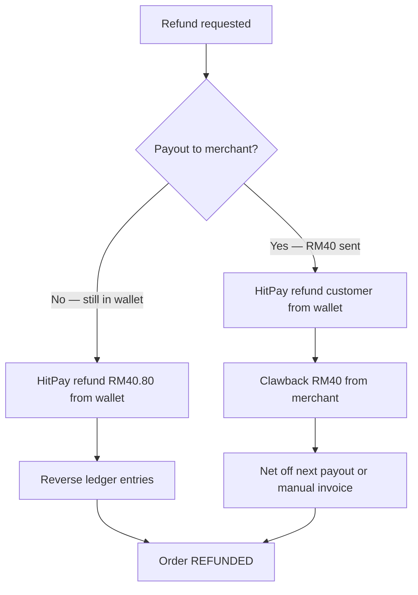

# Payment Rails — Miki · HitPay Aggregator Model

**Status:** Historical draft (June 2026) — **do not implement from this file.**  
**Build spec:** [`../requirements.md`](../requirements.md) (connected account per Brand, HitPay Recurring Billing, POS DuitNow QR + card). Remaining questions: [`../open-hitpay.md`](../open-hitpay.md).

**Date:** June 2026  
**Platform hub:** [`README.md`](README.md)  
**Related:** [`../modules/barbershop/features-and-pricing.md`](../modules/barbershop/features-and-pricing.md) · [`architecture.md`](architecture.md) · [`../product/engineering-modules.md`](../product/engineering-modules.md) (MOD-12) · [`../financial/ssot.md`](../financial/ssot.md)

> **Tier cap values** (e.g. Lite RM5k/mo) are **module-specific** — barbershop: [`../modules/barbershop/pricing-funnel.md`](../modules/barbershop/pricing-funnel.md).

---

## Executive summary

We collect customer payments through **one Company A HitPay account**. The customer pays **service subtotal + 2% processing fee** (e.g. RM40 + RM0.80 = **RM40.80**). HitPay deducts ~**1.2%** of the amount charged; we pay the merchant **RM40.00** and retain **~RM0.31** (~0.8% of service subtotal) after fees.

**Key design choice:** HitPay’s wallet is **one pool**; our **database ledger** is the per-merchant source of truth. We do **not** need one HitPay account per shop. Each checkout gets a **dynamic QR** (per order), not a permanent QR per merchant.

**Automation:** Payment webhook → ledger → payout queue → HitPay [Payouts API](https://docs.hitpayapp.com/apis/guide/payouts) (`POST /v1/transfers`) → transfer webhook.

**Tier gate (Option C′ — locked 2 Jul 2026):**

| Tier | Integrated rail (HitPay QR + card) | Customer fee | Reconcile dashboard |
| :--- | :--- | :--- | :--- |
| **Trial** | — | — | — |
| **Lite** | **Cap RM5,000 GMV/mo** · auto-close on webhook | **2%** on subtotal | — |
| **Ocelot** | **Unlimited** · auto-close | **2%** on subtotal | — |
| **Mantis+** | **Unlimited** · auto-close | **2%** on subtotal | ✓ |

Cash and merchant’s own DuitNow remain **exact subtotal, RM0** platform fee on **all tiers** (manual confirm).

**Lite cap rule:** Sum of `service_subtotal` on orders paid via HitPay in calendar month. When cap reached: **block new HitPay checkouts** until 1st of next month or upgrade to **Ocelot** (unlimited rail) or **Mantis** (unlimited + reconcile). Cash and own DuitNow unaffected. In-flight payments complete normally.

**Paid beats free:** Ocelot subscribers always get **more** payment-rail volume than Lite. Mantis adds **reconcile**, not access to the rail.

---

## Decision requested (co-founder sign-off)

| # | Decision | Recommendation |
| :---: | :--- | :--- |
| 1 | Adopt **single Company A HitPay account** + merchant bank payouts (aggregator model) | **Approve** |
| 2 | Customer pays **2% processing fee** on top of service subtotal; merchant books **subtotal only** | **Approve** |
| 3 | **Dynamic QR per order** via HitPay API (not merchant’s static HitPay QR on integrated rail) | **Approve** |
| 4 | **Pilot payout policy:** per-order auto-transfer vs daily batch | **Decide** (see [Payout policy](#payout-policy)) |
| 5 | Accept **pilot regulatory grey zone** (holding merchant funds briefly); legal review before scale | **Acknowledge** |
| 6 | **Refund policy** on HitPay rail (fee handling, payout clawback) | **Decide** (see [Refunds](#refunds)) |

**Approver:** _______________ **Date:** _______________

---

## Revenue split (per transaction)

Service is billed at **RM40.00**. We add **2%** processing fee → customer pays **RM40.80** total.

| Layer | Rate / amount | Notes |
| :--- | :--- | :--- |
| Service subtotal (merchant revenue) | RM40.00 | What the shop books |
| Customer processing fee (+2%) | RM0.80 | Shown on POS as one line |
| **Customer pays** | **RM40.80** | Sent to HitPay `payment-requests` |
| HitPay fee (~1.2% of RM40.80) | −RM0.49 | Applied on **gross charged**, not subtotal |
| Net to Company A wallet | ~RM40.31 | After HitPay deduction |
| Merchant payout | RM40.00 | Via `/v1/transfers` to merchant bank |
| **Company A cut** | **~RM0.31** | ~0.78% of RM40 subtotal; minus any payout transfer fee |

> **Rounding:** To net exactly 0.8% of subtotal, surcharge could be **2.016%** instead of 2%. Difference on small orders is &lt; RM0.01 — acceptable at pilot.

### What the customer sees

```
─────────────────────────────
  Items                RM40.00
  Processing fee        RM0.80
─────────────────────────────
  TOTAL                RM40.80
─────────────────────────────
  [ Scan QR to Pay ]
```

No breakdown of HitPay vs platform cut. One clean fee line (aligned with HitPay [Surcharge](https://docs.hitpayapp.com/pos/surcharge) UX pattern).

### What the backend records

```
Order #1234 — Outlet: Kedai Ali
────────────────────────────────────
  service_subtotal_cents    4000
  customer_total_cents      4080
  hitpay_fee_est_cents        49
  merchant_payout_cents     4000
  platform_fee_cents          31
  payout_status           SCHEDULED → SENT → DONE
```

---

## One wallet, many merchants

```
┌─────────────────────────────────────────────────────────┐
│  Company A HitPay wallet (single account)               │
│  Balance = all customer payments − HitPay fees − payouts │
└─────────────────────────────────────────────────────────┘
         ▲                              │
         │ RM40.80 × N payments         │ RM40.00 × N transfers
         │                              ▼
   Your ledger (Postgres)         Merchant A, B, C… banks
   ─ who owes what ─
```

HitPay only sees **Company A**. We attribute each RM40 to a shop using:

- `reference_number` on every `payment-request` (e.g. `ord_8f3a_out_12`)
- Internal tables: `orders`, `payment_intents`, `payouts`, `ledger_entries`

The HitPay wallet balance alone cannot answer “which RM40 is Ali’s” — **our ledger can**.

---

## Do we need different QRs per merchant?

**No permanent QR per merchant. One dynamic QR per checkout.**

| Type | Per merchant? | Prefilled RM40.80? | Auto-reconcile? |
| :--- | :---: | :---: | :---: |
| Static bank / merchant HitPay QR | Often yes | No | No |
| **Our flow: `payment-requests` / embedded QR** | **Per order** | **Yes** | **Yes** |

### Per-sale flow

1. POS has `outlet_id`, `order_id`, subtotal RM40.
2. Backend calls HitPay with **RM40.80** and e.g.:
   - `reference_number`: `ord_8f3a_out_12` (globally unique)
   - `purpose`: `Order #1234 — Kedai Ali`
3. POS displays **that** QR — valid for **this order only**.

Five merchants on one Company A account = five POS screens, each generating order QRs from the **same API key**. Customers do not share one QR; merchants do **not** need separate HitPay signups on this rail.

**What differs per merchant:** screen branding (shop name), `reference_number` encoding, payout `beneficiary_id` — not a separate HitPay merchant account.

---

## End-to-end automation



### Minimum data model (conceptual)

| Table | Role |
| :--- | :--- |
| `orders` | `subtotal_cents` 4000, `customer_total_cents` 4080, status |
| `payment_intents` | `hitpay_id`, `reference_number`, webhook state |
| `merchant_beneficiaries` | `outlet_id`, HitPay `beneficiary_id`, bank details |
| `payouts` | `order_id`, `amount_cents` 4000, `transfer_id`, status |
| `refunds` | `order_id`, `amount_cents`, `reason`, `hitpay_refund_id`, status, clawback status |
| `ledger_entries` | customer_in, hitpay_fee, merchant_payable, platform_revenue, reversals |

### Automation rules

1. **Create payment** — only our API calls HitPay on the integrated rail (not merchant static QR).
2. **Webhook handler** — HMAC-SHA256 verify; **idempotent** on `payment_id` ([API overview](https://docs.hitpayapp.com/apis/overview)).
3. **On paid** — mark order complete (POS auto-close) + enqueue payout.
4. **Payout worker** — `POST /v1/transfers` per [Payouts guide](https://docs.hitpayapp.com/apis/guide/payouts); store `transfer_id`; handle transfer webhooks.
5. **Wallet balance** — do not transfer until funds are available; retry queue if pending.

**Pilot (5 merchants):** steps 1–4 fully automated; manual intervention on failures only.  
**Scale (500 merchants):** same pipeline + batching, reconciliation cron, ops tooling.

---

## Reconciliation

### Daily (and on each webhook)

```
Wallet balance (HitPay dashboard)
  ≈  Sum(merchant_payables_pending)
   + Sum(platform_fees_retained)
   + Sum(payouts_in_flight)
   ±  timing / transfer fees
```

### Surfaces

| Audience | Data source |
| :--- | :--- |
| **Merchant** | `orders` + `payouts` filtered by `outlet_id` |
| **Ops** | Ledger + HitPay wallet; e.g. “Ali: RM40 pending payout” |

---

## Scale: 5 merchants vs 500 merchants

| | **5 merchants (pilot)** | **500 merchants** |
| :--- | :--- | :--- |
| HitPay accounts | 1 (Company A) | 1 (or HitPay enterprise — confirm) |
| QRs | Dynamic per order | Same — high volume `payment-requests` |
| Payouts | Per-order auto OK; manual fallback | **Daily batch** to reduce transfer fees |
| Onboarding | Collect bank once → [Create Beneficiary](https://docs.hitpayapp.com/apis/payout/create-beneficiary) | Self-serve bank form + verification |
| Reconciliation | SQL + spreadsheet | Daily job; alert if wallet ≠ ledger |
| Rate limits | OK (HitPay ~70 payment creates/min) | Queue + backoff at peak |
| Ops | Hand-fix failed payouts | Support tool + retry policies |
| Legal | Pilot grey zone | BNM / payment licence conversation |
| Payouts API | Beta acceptable for pilot | Production SLA from HitPay |

Architecture does **not** change at scale — **volume** drives batching, monitoring, and compliance.

---

## Payout policy

| Policy | Merchant experience | Ops | Transfer fees |
| :--- | :--- | :--- | :--- |
| **Instant per order** | Best | Simple | Higher (more API calls) |
| **Daily batch** | “Paid next business day” | One transfer/merchant/day | Lower |
| **Threshold** (e.g. ≥ RM100) | Small amounts accumulate | Fewer transfers | Lower |

**Settlement messaging for merchants:** *“Order closes instantly when customer pays; bank payout in ~1–2 business days.”*

- HitPay [Payouts](https://docs.hitpayapp.com/apis/guide/payouts): MYR local bank transfer **T+1** (beta API).
- Confirm **wallet credit timing** after customer payment vs transfer settlement.

**Launch recommendation:** **Per-order payout** for pilot (≤10 merchants); switch to **daily batch** before ~50 merchants unless transfer fees are negligible.

---

## Merchant onboarding (integrated rail)

We do **not** use the merchant’s HitPay account on this rail. Collect once per outlet:

| Field | Use |
| :--- | :--- |
| Legal / bank account name | Payout beneficiary |
| Bank account (MY local) | `POST /v1/transfers` |
| HitPay `beneficiary_id` | Reuse on every payout |
| `outlet_id` | Ledger attribution |

**Optional parallel path:** merchant’s **own** DuitNow / HitPay QR — exact subtotal, **RM0** platform fee, **manual** confirm in POS. No automatic platform cut on that rail.

---

## Refunds

Refunds are **materially harder** in the aggregator model than in “merchant owns HitPay” because money may have already left Company A’s wallet via `/v1/transfers`. A refund is not one button — it is a **multi-party reversal**: customer, HitPay, platform wallet, and possibly merchant bank.

### Why this matters

| Factor | Impact |
| :--- | :--- |
| **Customer paid RM40.80** | Refund amount policy must be explicit (full vs service-only) |
| **HitPay fee (~RM0.49)** | Often **not fully returned** by PSPs on refund — platform or merchant may absorb |
| **Merchant already paid RM40** | Must **claw back** from next payout or manual recovery |
| **Platform kept ~RM0.31** | May need to return all or part depending on policy |
| **Payout transfer fee** | Outbound transfer cost may not be reversed |
| **Timing** | Refund before payout is simple; after payout is ops-heavy |

### Refund scenarios



| Scenario | Customer gets | Merchant | Platform | Complexity |
| :--- | :--- | :--- | :--- | :--- |
| **A. Same day, payout not sent** | RM40.80 (recommended) | RM0 net | Reclaim ~RM0.31 from wallet | **Low** |
| **B. Payout already sent** | RM40.80 via HitPay refund API | Owes RM40 clawback | May lose fee margin + HitPay cost | **High** |
| **C. Partial refund** (e.g. one service) | Prorated subtotal + prorated fee? | Prorated clawback | Partial ledger reversal | **Medium** — define formula |
| **D. Cash / own QR payment** | Merchant handles cash | Merchant bears | N/A | **Out of platform flow** |

### Policy decisions (co-founder)

| # | Question | Options | Pilot recommendation |
| :---: | :--- | :--- | :--- |
| R1 | Refund **processing fee** (RM0.80) to customer? | Full RM40.80 · Service RM40 only | **Full RM40.80** — simpler, fairer; platform absorbs lost margin on that order |
| R2 | Who initiates HitPay refund? | Owner PIN only · Manager | **Owner PIN only** (matches void in [`../modules/barbershop/spec.md`](../modules/barbershop/spec.md)) |
| R3 | When allowed? | Same day only · Within 7 days · Anytime | **Same day + payout not sent** for v1; expand later |
| R4 | After merchant payout sent? | Block auto · Allow with clawback | **Allow with clawback** — deduct from next payout; flag if insufficient balance |
| R5 | Partial refunds? | Yes · No v1 | **No v1** — full order refund only; barbershop tickets are small |
| R6 | Stamp / loyalty on refunded visit? | Reverse stamp · Keep | **Reverse stamp** if granted on that payment |

### Money flow on full refund (RM40 service)

**Before merchant payout (ideal):**

```
HitPay refund to customer     +RM40.80  (from wallet)
Reverse merchant payable      −RM40.00
Reverse platform fee          −RM0.31
HitPay fee (sunk cost)        −RM0.49  (often not returned — confirm with HitPay)
```

**After merchant payout:**

```
1. HitPay refund customer      RM40.80  (wallet must have balance)
2. Merchant clawback           RM40.00  (debit merchant_ledger_balance)
3. Platform may net-loss       ~RM0.49 + transfer fees if HitPay doesn't rebate
```

Track **`merchant_ledger_balance`** (amount we owe merchant minus amount they owe us from clawbacks) so batch payouts net correctly.

### Operational rules (v1)

1. **Void vs refund** — **Void** = same day, before customer paid or before settlement; **Refund** = money already captured via HitPay.
2. **Hold payout window** — optional **24h delay** before `/v1/transfers` reduces refund-before-payout cases (trade-off vs merchant cash-flow).
3. **Idempotent refund** — one `refund_id` per order; webhook from HitPay marks `refunds.status = COMPLETED`.
4. **Insufficient wallet** — if refund requested but wallet low (payouts ahead of settlements), queue refund or top up wallet manually.
5. **Audit log** — who, when, reason, amounts (PDPA + dispute resolution).

### Merchant-facing copy (draft)

**EN:** *“Refunds on HitPay payments return the full amount paid (including processing fee) to the customer. If we’ve already paid out to your bank, the refund is deducted from your next settlement.”*

**BM:** *“Refund bayaran HitPay — customer dapat balik jumlah penuh. Kalau dah transfer ke bank anda, tolak dari payout seterusnya.”*

### Pilot scope

| Phase | Refund capability |
| :--- | :--- |
| **Phase 1A** | Cash / own QR — merchant handles manually; POS void owner PIN |
| **Phase 1B launch** | HitPay **full refund**, owner PIN, same-day preferred; clawback ledger |
| **Post-PMF** | Partial refunds, automated clawback UI, HitPay refund API fully automated |

### Open validation (refunds)

- [ ] HitPay **refund API** for `payment-requests` — full vs partial, timeline, fees retained?
- [ ] Refund from **wallet** when balance already paid out to merchants — float / top-up process?
- [ ] **Clawback** legally enforceable in merchant T&C?
- [ ] Customer dispute chargeback flow — who bears cost?

---

## Failure modes

| Case | Handling |
| :--- | :--- |
| Duplicate webhook | Idempotency on `payment_id` |
| Paid but payout fails | Retry with backoff; merchant UI: “Payout pending” |
| Insufficient wallet balance | Hold payout queue until credited |
| Wrong amount paid | Flag for manual review; do not auto-complete |
| Refund requested | See [Refunds](#refunds) — payout timing drives clawback |
| Refund + insufficient wallet | Queue or ops top-up; do not mark complete until funded |
| Merchant clawback exceeds next payout | Hold payout; ops contact merchant |

---

## What we explicitly do not do

| Anti-pattern | Why |
| :--- | :--- |
| Block checkout unless HitPay is used | Merchants mark “Cash” and churn |
| Take 0.8% on merchant’s own static QR | We are not in the money path |
| One shared static QR for all shops | Cannot prefilled amount per order |
| Show HitPay vs platform fee split to customer | One “Processing fee” line only |

---

## HitPay references

| Topic | Doc |
| :--- | :--- |
| API entry points (embedded QR, webhooks) | [API Overview](https://docs.hitpayapp.com/apis/overview) |
| Customer surcharge UX pattern | [Surcharge (POS)](https://docs.hitpayapp.com/pos/surcharge) |
| Merchant bank payouts | [Payouts API](https://docs.hitpayapp.com/apis/guide/payouts) (beta) |
| Saved beneficiaries | [Create Beneficiary](https://docs.hitpayapp.com/apis/payout/create-beneficiary) |

---

## Open validation (before build)

- [ ] HitPay confirms **2% customer surcharge** on API `payment-requests` in Malaysia
- [ ] Confirm **1.2%** processing rate on gross charged (RM40.80)
- [ ] **Payouts API** production readiness for MYR + fees per transfer
- [ ] **Wallet availability** timing after payment vs payout T+1
- [ ] **Card tap** path — device/API requirements vs “QR on counter” v1
- [ ] Legal review: holding merchant funds between collection and payout
- [ ] HitPay **refund API** — fees on refund, partial support, wallet behaviour

---

## FAQ (co-founder)

**Q: Can merchants keep their own HitPay QR and we still take 0.8%?**  
A: **No**, not automatically. Their QR settles to them. Integrated rail = **our** dynamic QR + ledger + payout.

**Q: How do we make money on transactions?**  
A: Customer pays 2% on our rail; we retain residual after HitPay fee and merchant RM40 payout (~RM0.31/order on RM40 service).

**Q: One wallet — how do we know whose money it is?**  
A: `reference_number` + ledger tables. Wallet is the cash pool; Postgres is attribution.

**Q: 500 merchants — 500 HitPay accounts?**  
A: **No.** One Company A account; 500 beneficiaries; dynamic QRs per order.

**Q: Customer wants refund after HitPay pay?**  
A: Full **RM40.80** back if policy R1 approved. If merchant already paid, **clawback RM40** from future payouts. HitPay’s ~RM0.49 may be a **sunk cost** — confirm with HitPay.

**Q: Can we skip refunds in pilot?**  
A: **Risky** — disputes and wrong charges happen. Minimum: owner PIN full refund + manual ops; automate HitPay refund API in Phase 1B.

---

## Decision log

| Date | Decision |
| :--- | :--- |
| 2026-06 | Aggregator model drafted for co-founder approval |
| 2026-06 | Refunds section — clawback, fee policy, pilot scope |
| — | Payout policy (per-order vs daily batch) — **pending** |
| — | Refund policy R1–R6 — **pending** |

---

*After approval: sync [`architecture.md`](architecture.md) §4, [`../product/engineering-modules.md`](../product/engineering-modules.md) MOD-12, and [`../financial/ssot.md`](../financial/ssot.md) PAY assumptions.*
