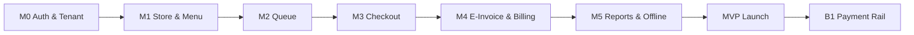

# Feature Modules — Miki · Phase 1 Build & Design Spec

**Platform:** Miki · **Module:** Barbershop booking, queue & POS (see [`../modules/barbershop/spec.md`](../modules/barbershop/spec.md))  
**Screens:** [`../modules/barbershop/ui.md`](../modules/barbershop/ui.md)  
**Authority:** [`../planning/phase1-plan.md`](../planning/phase1-plan.md) · [`../planning/initial-brd.md`](../planning/initial-brd.md)

> **Changelog:** Generic walk-in-only queue superseded by barbershop booking calendar + shared POS. MyInvois **removed from barbershop v1** (receipt SMS only).

---

## Build Order (Sprints)



| Sprint | Modules | Milestone |
| :--- | :--- | :--- |
| **M0** (Month 1) | MOD-01, MOD-02 (skeleton), MOD-03 | Auth works; tenant + store created |
| **M1** (Month 2) | MOD-04, MOD-05, MOD-06 (core) | Menu CRUD web; queue in staff app |
| **M2** (Month 3) | MOD-07, MOD-10, MOD-11 | Checkout, receipt, offline sync |
| **M3** (Month 4) | MOD-08, MOD-02 (full), MOD-09, MOD-15 | Billing, trial, reports, CRM + stamps |
| **Launch** | Polish, limits, QA | App Store / Play Store |
| **1B** (Month 4–8) | MOD-12, MOD-13, MOD-14 | Payments, reconcile, SMS, accountant |

---

## Applications & Ownership

| App | Path (proposed) | Modules consumed |
| :--- | :--- | :--- |
| **Backend** | `apps/api/` | All MOD-* |
| **Owner Web** | `apps/owner-web/` | MOD-01–06, 09, 02 |
| **POS** | `apps/pos/` | MOD-01, 06–11 |
| **Customer Web** | `apps/customer-web/` | MOD-05, 06–08 |

---

## Module Index

| ID | Module | Phase | Priority |
| :--- | :--- | :--- | :--- |
| MOD-01 | Auth & Session | 1A | Must |
| MOD-02 | Subscription & Billing | 1A | Must |
| MOD-03 | Store & Settings | 1A | Must |
| MOD-04 | Staff & RBAC | 1A | Must |
| MOD-05 | Service Menu | 1A | Must |
| MOD-06 | Queue | 1A | Must |
| MOD-07 | Checkout & Payments | 1A / 1B | Must |
| MOD-08 | Receipts & E-Invoice | 1A | Must |
| MOD-09 | Reporting | 1A | Must |
| MOD-10 | Offline Sync | 1A | Must |
| MOD-11 | Device Registry | 1A | Must |
| MOD-12 | Payment Rail (HitPay) | 1B | Must |
| MOD-13 | Reconciliation | 1B | Must |
| MOD-14 | Growth (SMS, Accountant, Referral) | 1B | Should |
| MOD-15 | Customers & Stamps | 1A | Must |

---

## MOD-01 — Auth & Session

### Purpose
Managed authentication for merchants and staff across web and mobile. No custom password infrastructure.

### Provider
Clerk, Supabase Auth, or Firebase Auth (pick one before M0). Backend validates JWT / session tokens.

### Features
| ID | Feature |
| :--- | :--- |
| A-01 | Merchant sign-up (email + password or OAuth) |
| A-02 | Merchant login / logout |
| A-03 | Staff invited by owner; staff login on mobile |
| A-04 | Password reset via provider |
| A-05 | Email verification before full activation (Should) |
| A-06 | Session refresh on staff app (long shifts) |

### Entities
```
User
  id, auth_provider_id, email, name, phone?, created_at

MerchantAccount
  id, owner_user_id, business_name, trial_ends_at, created_at

Membership
  user_id, merchant_id, role: OWNER | STAFF
```

### API (sketch)
| Method | Path | Description |
| :--- | :--- | :--- |
| POST | `/auth/webhook` | Provider events (user created) |
| GET | `/me` | Current user + memberships |
| POST | `/merchants` | Create merchant on first onboarding |

### Screens
| Surface | Screen |
| :--- | :--- |
| Web | Sign up, Login, Forgot password |
| Staff app | Login, Accept invite (deep link) |

### Acceptance criteria
- [ ] Owner completes sign-up and lands in onboarding within 2 minutes
- [ ] Staff cannot access merchant web billing routes
- [ ] Invalid/expired token returns 401 on all protected routes
- [ ] One user can be OWNER of exactly one merchant in Phase 1A

### Dependencies
None (first module).

---

## MOD-02 — Subscription & Billing

### Purpose
Enforce Ocelot / Mantis / Patriot tiers, 14-day trial → Lite exit ramp, plan limits, and subscription payment collection.

### Plans (Phase 1A)
| Plan | Price | Key limits |
| :--- | :--- | :--- |
| Trial | 14-day full Ocelot | 4 barbers, unlimited bookings |
| Ocelot Lite | RM0 (post-trial only) | 1 barber, 25 online bookings/mo, basic offline |
| Ocelot | RM109/mo | 4 barbers, unlimited bookings, full calendar, **HitPay unlimited** |
| Mantis | RM199/mo | 8 barbers, 2 locations, **reconcile dashboard** + commission |
| Patriot | RM349/mo | Multi-branch HQ, unlimited barbers |

### Features
| ID | Feature |
| :--- | :--- |
| B-01 | Start 14-day full Ocelot trial on merchant creation |
| B-02 | Day 14: subscribe (Ocelot+) or downgrade to Ocelot Lite |
| B-03 | Enforce limits (barbers, bookings, locations) — block + upgrade CTA; **never** kill customer QR |
| B-04 | Subscription status: trialing, lite, active, past_due, canceled |
| B-05 | Payment method on file (Stripe / Curlec / billplz — pick at M3) |
| B-06 | Annual prepay option (10 for 12) |
| B-07 | 1 trial per phone / 12 mo; founding barber RM89 lock |

### Entities
```
Subscription
  id, merchant_id, plan: TRIAL | LITE | OCELOT | MANTIS | PATRIOT
  status, current_period_end, payment_provider_customer_id

PlanUsage
  merchant_id, period_start, online_booking_count, barber_count
```

### API
| Method | Path | Description |
| :--- | :--- | :--- |
| GET | `/subscription` | Current plan + usage vs limits |
| POST | `/subscription/change-plan` | Lite → Ocelot ↔ Mantis ↔ Patriot |
| GET | `/subscription/limits` | For client-side gating |
| POST | `/billing/webhook` | Payment provider events |

### Screens
| Surface | Screen |
| :--- | :--- |
| Web | Plan picker (onboarding), Billing settings, Upgrade modal |
| Staff app | Upgrade prompt when limit hit |

### Acceptance criteria
- [ ] Trial expires → merchant prompted Lite or Ocelot; POS read-only until resolved
- [ ] Adding 2nd barber on Lite blocked with upgrade message
- [ ] Outlet count gated by plan (1 / 2 / 5+)

### Dependencies
MOD-01, MOD-03

---

## MOD-03 — Company, Outlets & Settings

### Purpose
**Company → Outlet** model from day 1. Solo onboarding auto-creates 1 company + 1 outlet; multi prompts org then outlets. Tier limits outlet count in UI.

### Features
| ID | Feature |
| :--- | :--- |
| S-01 | Onboarding: solo vs multi path |
| S-02 | Create company + outlet(s) — name, address, phone, SST reg optional |
| S-03 | Business hours display on queue board (optional) |
| S-04 | Currency MYR; timezone Asia/Kuala_Lumpur |
| S-05 | Receipt header/footer text per outlet |
| S-06 | Default avg service duration (minutes) for wait estimate |

### Entities
```
Company
  id, name, onboarding_mode: SOLO | MULTI

Outlet
  id, company_id, name, address, phone, settings_json
  timezone, receipt_footer?, avg_service_minutes, created_at
```

### API
| Method | Path | Description |
| :--- | :--- | :--- |
| GET | `/outlets` | List outlets for company |
| GET | `/outlets/{id}` | Outlet profile |
| PATCH | `/outlets/{id}` | Update settings |
| POST | `/onboarding/complete` | Mark setup done (solo or multi path) |

### Screens
| Surface | Screen |
| :--- | :--- |
| Web | Onboarding wizard (steps 1–4), Store settings |
| Staff app | Read-only store name in header |

### Acceptance criteria
- [ ] Exactly one store per merchant in Phase 1A
- [ ] Onboarding cannot skip store name

### Dependencies
MOD-01

---

## MOD-04 — Staff & RBAC

### Purpose
Invite staff, assign roles, enforce permissions.

### Roles (Phase 1A)
| Role | Permissions |
| :--- | :--- |
| **OWNER** | All web + all staff app actions |
| **STAFF** | Queue, checkout, view menu; no billing, no staff mgmt |

### Features
| ID | Feature |
| :--- | :--- |
| R-01 | Owner invites staff by email |
| R-02 | Staff limit per plan (Lite 2, Pro 8) |
| R-03 | Deactivate staff (cannot login) |
| R-04 | Audit: who completed checkout (staff_id on transaction) |

### Entities
```
StaffInvite
  id, merchant_id, email, role, token, expires_at, accepted_at?
```

### API
| Method | Path | Description |
| :--- | :--- | :--- |
| GET | `/staff` | List staff |
| POST | `/staff/invite` | Send invite |
| DELETE | `/staff/{id}` | Deactivate |
| POST | `/staff/accept-invite` | Staff accepts |

### Screens
| Surface | Screen |
| :--- | :--- |
| Web | Staff list, Invite form |
| Staff app | — |

### Acceptance criteria
- [ ] STAFF cannot call billing or staff management APIs (403)
- [ ] Deactivated staff session invalidated on next request

### Dependencies
MOD-01, MOD-02

---

## MOD-05 — Service Menu

### Purpose
Catalogue of services (haircut, manicure, consultation) — not F&B dishes.

### Features
| ID | Feature |
| :--- | :--- |
| M-01 | CRUD categories |
| M-02 | CRUD service items: name, price (sen), category, active flag |
| M-03 | Optional photo per item (CDN URL) |
| M-04 | Lite: max 20 active services |
| M-05 | Pro: unlimited |
| M-06 | Deactivate (hide from checkout, keep history) |

### Entities
```
Category
  id, store_id, name, sort_order

ServiceItem
  id, store_id, category_id, name, description?, price_cents
  photo_url?, is_active, sort_order
```

### API
| Method | Path | Description |
| :--- | :--- | :--- |
| GET | `/menu/categories` | List with items |
| POST | `/menu/categories` | Create |
| POST | `/menu/items` | Create (check limit) |
| PATCH | `/menu/items/{id}` | Update |
| DELETE | `/menu/items/{id}` | Soft deactivate |

### Screens
| Surface | Screen |
| :--- | :--- |
| Web | Menu manager (categories + items) |
| Staff app | Service picker at checkout (read-only) |

### Acceptance criteria
- [ ] 21st service on Lite returns 402/403 with upgrade payload
- [ ] Inactive items not shown in checkout
- [ ] Prices stored as integer cents (no float money)

### Dependencies
MOD-03, MOD-02

---

## MOD-06 — Queue

### Purpose
Walk-in waitlist — core wedge for barbers/salons/clinics.

### Features
| ID | Feature | Ref |
| :--- | :--- | :--- |
| Q-01 | Take next queue number per store per day | phase1 Q-01 |
| Q-02 | Add entry: number, optional name/phone | Q-02 |
| Q-03 | Actions: call next, skip, no-show, complete | Q-03 |
| Q-04 | Queue board: now serving + waiting list | Q-04 |
| Q-05 | Est. wait = queue_position × avg_service_minutes | Q-05 |
| Q-06 | Link queue entry → checkout when service done | — |

### State machine
```
WAITING → CALLED → IN_SERVICE → COMPLETED
         ↘ SKIPPED
         ↘ NO_SHOW
```

### Entities
```
QueueDay
  store_id, date, last_number_issued

QueueEntry
  id, store_id, number, status, customer_name?, customer_phone?
  called_at?, completed_at?, transaction_id?, created_at
```

### API
| Method | Path | Description |
| :--- | :--- | :--- |
| GET | `/queue/today` | All entries + now serving |
| POST | `/queue/entries` | Add walk-in |
| POST | `/queue/call-next` | CALLED on oldest WAITING |
| PATCH | `/queue/entries/{id}` | skip, no-show, in-service, complete |
| WS | `/ws/queue` | Broadcast queue updates |

### Screens
| Surface | Screen |
| :--- | :--- |
| Staff app | Queue list, Call next FAB, Entry detail |
| Web | Queue board (full-screen TV mode via browser) |
| Staff app | Mini queue strip during checkout |

### Acceptance criteria
- [ ] Queue numbers reset daily; format `#1`, `#2`… (display only)
- [ ] WebSocket updates board within 2s of action
- [ ] Complete flow can open checkout pre-linked to entry
- [ ] Two staff calling next concurrently — only one wins (optimistic lock)

### Dependencies
MOD-03, MOD-04, MOD-10 (offline queue actions)

---

## MOD-07 — Checkout & Payments

### Purpose
Ring up services, record payment method, close sale.

### Phase 1A payment paths
| Method | Code | Fee | Verification |
| :--- | :--- | :--- | :--- |
| Cash | `CASH` | RM0 | Staff confirms |
| Other DuitNow | `EXTERNAL_QR` | RM0 | Staff confirms manually |

### Phase 1B adds (HitPay — Lite cap · Ocelot+ unlimited)
| Method | Code | Customer fee | Merchant fee |
| :--- | :--- | :--- | :--- |
| HitPay QR | `HITPAY_QR` | 2% of subtotal | RM0 |
| HitPay card tap | `HITPAY_CARD` | 2% of subtotal | RM0 |

### Features
| ID | Feature |
| :--- | :--- |
| P-01 | Create transaction from 1+ service line items |
| P-02 | Link optional queue_entry_id |
| P-03 | Subtotal in sen; display **service fee (2%)** + total to customer on HitPay |
| P-04 | Select payment method; complete sale |
| P-05 | Void same-day transaction (owner only) — Should |
| P-06 | Phase 1B: HitPay flow — QR display + card tap + webhook polling |

### Entities
```
Transaction
  id, store_id, staff_id, queue_entry_id?, status: OPEN | COMPLETED | VOIDED
  subtotal_cents, payment_method?, completed_at?, client_sync_id?

TransactionLine
  id, transaction_id, service_item_id, name_snapshot, price_cents, qty
```

### API
| Method | Path | Description |
| :--- | :--- | :--- |
| POST | `/transactions` | Open cart |
| POST | `/transactions/{id}/lines` | Add line |
| POST | `/transactions/{id}/complete` | body: `{ paymentMethod }` |
| POST | `/transactions/{id}/void` | Owner only |

### Screens
| Surface | Screen |
| :--- | :--- |
| Staff app | Service picker → Cart → Payment method → Done |
| Staff app | Phase 1B: HitPay screen — subtotal + 2% fee + total; QR + card tap |

### Acceptance criteria
- [ ] Completed transaction immutable except void by owner
- [ ] EXTERNAL_QR does not call payment partner
- [ ] Receipt generated on complete (MOD-08)
- [ ] Offline complete queues with client_sync_id; no duplicate on sync

### Dependencies
MOD-05, MOD-06, MOD-08, MOD-10, MOD-11

---

## MOD-08 — Receipts & E-Invoice

### Purpose
Standard receipts for all tiers; LHDN MyInvois on Pro when customer requests.

### Features
| ID | Feature |
| :--- | :--- |
| C-01 | Digital receipt after checkout (HTML/PDF link) |
| C-02 | Pro: issue MyInvois e-invoice on request |
| C-03 | Collect buyer TIN/name for e-invoice when required |
| C-04 | Track e_invoice_count against Pro 500/mo limit |
| C-05 | Lite: receipt only, no MyInvois API call |
| C-06 | Share receipt via system share sheet (staff app) |

### Entities
```
Receipt
  id, transaction_id, receipt_number, public_token, pdf_url?

EInvoice
  id, transaction_id, myinvois_uuid?, status: PENDING | VALIDATED | FAILED
  buyer_name?, buyer_tin?, validated_at?, error_message?
```

### API
| Method | Path | Description |
| :--- | :--- | :--- |
| GET | `/transactions/{id}/receipt` | Receipt data |
| POST | `/transactions/{id}/e-invoice` | Submit to MyInvois (Pro only) |
| GET | `/receipts/public/{token}` | Customer-facing receipt page |

### Screens
| Surface | Screen |
| :--- | :--- |
| Staff app | Receipt success, "Issue e-Invoice" toggle + buyer form |
| Web | E-invoice history list |

### Acceptance criteria
- [ ] Lite plan e-invoice API returns 403 with upgrade message
- [ ] MyInvois validation errors shown to staff; transaction still completed
- [ ] Receipt number unique per store per day

### Dependencies
MOD-02, MOD-07, MyInvois API credentials (M3)

---

## MOD-09 — Reporting

### Purpose
Owner visibility into daily sales.

### Features
| ID | Feature |
| :--- | :--- |
| RP-01 | Today: transaction count, gross sales, by payment method |
| RP-02 | Date range filter |
| RP-03 | Export CSV (Should S-03) |
| RP-04 | Top services by revenue (Should) |

### API
| Method | Path | Description |
| :--- | :--- | :--- |
| GET | `/reports/sales-summary?from&to` | Aggregates |
| GET | `/reports/export.csv` | CSV download |

### Screens
| Surface | Screen |
| :--- | :--- |
| Web | Dashboard home, Sales report |
| Staff app | Today total (optional widget) |

### Acceptance criteria
- [ ] Summary matches sum of completed transactions for period
- [ ] VOIDED excluded from totals

### Dependencies
MOD-07

---

## MOD-10 — Offline Sync

### Purpose
Queue and checkout work when Wi-Fi drops; sync when back online.

### Features
| ID | Feature |
| :--- | :--- |
| O-01 | Staff app detects connectivity |
| O-02 | Queue actions stored in local queue (SQLite / WatermelonDB / MMKV) |
| O-03 | Transactions completed offline with UUID client_sync_id |
| O-04 | On reconnect: push pending ops; server idempotent by client_sync_id |
| O-05 | Conflict: server wins on menu prices; client wins on queue order with merge UI if needed |

### API
| Method | Path | Description |
| :--- | :--- | :--- |
| POST | `/sync/batch` | `{ operations: [...] }` idempotent |

### Screens
| Surface | Screen |
| :--- | :--- |
| Staff app | Offline banner, "N changes pending sync" |

### Acceptance criteria
- [ ] Complete offline sale syncs once without duplicate transaction
- [ ] Queue board updates after sync within 5s of reconnect

### Dependencies
All write modules on staff app

---

## MOD-11 — Device Registry

### Purpose
Enforce per-plan device limits (Lite 1, Pro 3).

### Features
| ID | Feature |
| :--- | :--- |
| D-01 | Register device on staff app login (device_id + name) |
| D-02 | Block login if device limit exceeded |
| D-03 | Owner can revoke device from web |

### Entities
```
Device
  id, merchant_id, device_fingerprint, label?, last_seen_at, revoked_at?
```

### API
| Method | Path | Description |
| :--- | :--- | :--- |
| POST | `/devices/register` | Register or refresh |
| GET | `/devices` | List (owner) |
| DELETE | `/devices/{id}` | Revoke |

### Acceptance criteria
- [ ] 2nd device on Lite blocked at registration with upgrade CTA

### Dependencies
MOD-02, MOD-01

---

## MOD-12 — Payment Rail (HitPay — Phase 1B)

### Purpose
HitPay integration: prefilled DuitNow QR + card tap on phone. Customer pays **subtotal + 2%**; merchant receives subtotal; webhook auto-completes transaction.

### Features
| ID | Feature |
| :--- | :--- |
| PR-01 | **Lite:** HitPay with **RM5k/mo** `service_subtotal` cap · **Ocelot+:** unlimited · reconcile UI **Mantis+** only |
| PR-02 | Create HitPay session for transaction (subtotal + fee breakdown) |
| PR-03 | Webhook from HitPay → mark paid → complete transaction |
| PR-04 | Card tap flow on same fee rules as QR |
| PR-05 | Staff can still choose Cash / External DuitNow (exact subtotal, RM0) |

### API
| Method | Path | Description |
| :--- | :--- | :--- |
| POST | `/payments/hitpay-session` | Create QR/card session for transaction |
| POST | `/payments/hitpay/webhook` | HitPay callback |
| GET | `/payments/hitpay-session/{id}/status` | Poll fallback |

### Dependencies
MOD-02, MOD-07, HitPay merchant agreement (validate 2% customer surcharge)

---

## MOD-13 — Reconciliation (Phase 1B)

### Purpose
Show matched vs unmatched orders; nudge HitPay adoption.

### Features
| ID | Feature |
| :--- | :--- |
| RC-01 | Daily: total sales vs HitPay vs cash vs external QR |
| RC-02 | Unmatched external QR warning count |
| RC-03 | Accountant view read-only (MOD-14) |

### Screens
| Surface | Screen |
| :--- | :--- |
| Web | Reconciliation dashboard |

### Dependencies
MOD-07, MOD-12

---

## MOD-14 — Growth (Phase 1B)

### Purpose
SMS, accountant access, referrals.

| Submodule | Features |
| :--- | :--- |
| SMS | Appointment/queue reminders; RM79/mo add-on |
| Accountant | Invite read-only; multi-merchant view; RM49/mo |
| Referral | Code per merchant; **1 month bill credit** after referee pays 1 month |

Defer detailed spec until Phase 1A launch.

---

## MOD-15 — Customers & Stamps (Phase 1A)

### Purpose
Auto customer profiles from booking phone; stamp loyalty on **paid** visits (Ocelot+; Lite excluded).

### Features
| ID | Feature |
| :--- | :--- |
| CU-01 | Upsert `Customer` on booking phone + name |
| CU-02 | Visit history + lifetime spend on owner web |
| CU-03 | 1 active stamp campaign per outlet (Ocelot+) |
| CU-04 | Grant stamp on `Transaction` completed (not on booking alone) |
| CU-05 | Merchant view: stamps remaining; manual remind v1 |

### Entities
```
Customer
  id, outlet_id, phone_e164, display_name, visit_count, lifetime_spend_cents

StampCampaign
  id, outlet_id, visits_required, active, tier_gate: OCELOT+

StampLedger
  id, customer_id, transaction_id?, stamps_earned, created_at
```

### Dependencies
MOD-05 (booking), MOD-07 (payment), MOD-02 (tier gate)

---

| Topic | Rule |
| :--- | :--- |
| Money | Integer `*_cents` (MYR) |
| IDs | UUID v4 |
| Timestamps | UTC ISO-8601 in API; display in store timezone |
| Errors | `{ code, message, upgrade?: { plan } }` for limit hits |
| Auth header | `Authorization: Bearer <token>` |
| Versioning | `/api/v1/...` |
| Pagination | `?page&limit` on list endpoints |

---

## Cross-Cutting: Design Tokens (starter)

| Token | Value |
| :--- | :--- |
| Primary | `#2563EB` (actions) |
| Success | `#16A34A` (paid, validated) |
| Warning | `#F59E0B` (offline, unmatched) |
| Queue board font | Large monospace for numbers |
| Touch targets | Min 44pt on staff app |

Staff app optimises for **one-thumb operation** at a busy counter.

---

## Out of Scope (do not build)

See [`../planning/phase1-plan.md`](../planning/phase1-plan.md) §5.3. Includes: F&B customer web, kitchen, tables, multi-store, inventory, loyalty v1, delivery.

Parked F&B reference: [`../archive/fb-pos-brd-phase2.md`](../archive/fb-pos-brd-phase2.md)

---

## Document Map

| Document | Role |
| :--- | :--- |
| **[`engineering-modules.md`](engineering-modules.md)** | This file — build & design spec |
| **[`../planning/phase1-plan.md`](../planning/phase1-plan.md)** | Execution timeline & gates |
| **[`../planning/initial-brd.md`](../planning/initial-brd.md)** | Business strategy & pricing |
| **[`../archive/fb-pos-brd-phase2.md`](../archive/fb-pos-brd-phase2.md)** | F&B Phase 2 (parked) |

---

*Start with MOD-01 → MOD-03 in `apps/api`, then parallel staff app queue (MOD-06) and web menu (MOD-05).*
