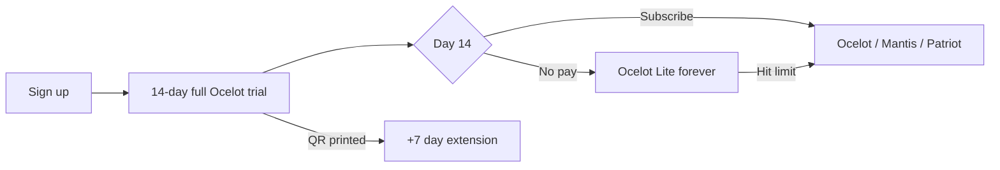

# Features & Pricing Packages — Barbershop Phase 1

**Use this doc to:** pick what goes in each price package · brief designers/devs · sell to merchants  
**Product rules:** [`barbershop-spec.md`](barbershop-spec.md)  
**Financial model:** [`../financial/ssot.md`](../financial/ssot.md)

**Legend:** **1A** = MVP launch · **1B** = payment rail phase · **Later** = not Phase 1

**Tier names:** Ocelot (starter) · Mantis (growth) · Patriot (pro) · Arsenal (enterprise)  
**Trial exit ramp:** Ocelot **Lite** — not a signup tier; automatic after 14-day trial if merchant does not subscribe.

---

# Part 1 — Feature catalog

## A. Customer booking (web — no app, no account)

| Feature | What it does | Phase |
| :--- | :--- | :--- |
| Shop QR entry | Customer scans shop QR → booking landing | 1A |
| Guest booking | Nickname + phone only — no signup | 1A |
| Service selection | Pick one or more services from menu | 1A |
| Party / group size | One booking for multiple people (e.g. 3 haircuts) | 1A |
| Date & time slot | Book a slot on the calendar | 1A |
| Booking number | Daily queue # (e.g. #42) | 1A |
| Status page | Unique URL to track booking lifecycle | 1A |
| Now serving display | Show shop’s current serving # on status page | 1A |
| Find my booking | Lookup by phone + date if link lost | 1A |
| Pick your barber | Customer chooses barber + sees their slots | 1A |
| Barber availability | Show **Full** when barber at daily cap | 1A |
| Auto-assign barber | System picks barber when pick-barber is off | 1A |

---

## B. Calendar & scheduling (owner)

| Feature | What it does | Phase |
| :--- | :--- | :--- |
| Per-barber calendar | Separate timetable per chair | 1A |
| Working hours | Set open/close per barber per day | 1A |
| Service duration | Each service has length (e.g. 30 min) | 1A |
| Service buffer | Gap after service (e.g. 5 min cleanup) | 1A |
| Slot generation | Auto-build bookable slots from duration + buffer | 1A |
| Daily cap per barber | Max customers/day — prevent burnout | 1A |
| Walk-in-only blocks | Reserve peak hours for walk-ins only | 1A |
| Master week view | All barbers on one calendar | 1A |
| Reassign barber | Move booking to another barber before cut | 1A |
| Auto no-show | Mark missed after X min late (default 15) | 1A |
| Late override | Manager can still check in late customer | 1A |
| Early arrival rule | Up to 10 min early — wait for turn | 1A |

---

## C. Queue & booking operations (hybrid)

| Feature | What it does | Phase |
| :--- | :--- | :--- |
| Online booking | Customer books via web → slot reserved | 1A |
| Walk-in booking | Staff adds customer on POS | 1A |
| Hybrid coexistence | Online + walk-in same day without conflict | 1A |
| Walk-in queue priority | Walk-ins can pass other walk-ins, not live bookings | 1A |
| Booking lifecycle | BOOKED → ARRIVED → IN_SERVICE → PAID (+ NO_SHOW) | 1A |
| Arrival check-in | Manager marks customer arrived (name verify) | 1A |
| Planned vs actual services | Book haircut online, add beard trim at chair | 1A |
| Overlap warning | Alert if add-on runs into next appointment | 1A |
| Party check-in | Check in whole group or adjust party size | 1A |

---

## D. POS — shared counter

| Feature | What it does | Phase |
| :--- | :--- | :--- |
| Shared terminal | One shop tablet/PC at counter | 1A |
| Barber switcher | Tap barber avatar — actions tied to that person | 1A |
| Today board | Timeline of today’s bookings + walk-ins | 1A |
| Filter by barber | View one chair’s line | 1A |
| Mark arrived | Customer showed up | 1A |
| Mark no-show | Customer missed slot | 1A |
| Cancel booking | Remove before service | 1A |
| Add walk-in | New customer without web booking | 1A |
| Add service at chair | Upsell / change services before pay | 1A |
| Start service | Customer in chair | 1A |
| Complete service | Ready for payment | 1A |
| Void / refund | Owner PIN — reverse transaction | 1A |
| Barber day stats | Quick view: cuts & revenue today | 1A |
| Offline operation | POS works without internet | 1A |
| Offline sync | Queue changes locally → push when online | 1A |

---

## E. Service menu (catalogue)

| Feature | What it does | Phase |
| :--- | :--- | :--- |
| Categories | Group services (Cut, Colour, etc.) | 1A |
| Service name & price | Core catalogue fields | 1A |
| Duration & buffer | Drives calendar slots | 1A |
| Service photo | Optional image on menu | 1A |
| Active / inactive | Hide without deleting | 1A |

---

## F. Payments

| Feature | What it does | Phase |
| :--- | :--- | :--- |
| Pay after service | No pay-before-cut | 1A |
| Cash | Manual confirm at counter | 1A |
| Own DuitNow QR | Customer pays merchant bank QR — staff confirms | 1A |
| App QR (dynamic) | Platform DuitNow — amount pre-filled | 1B |
| Auto-complete on App QR | Payment → order closed automatically | 1B |
| App QR fee | 0.7% on platform QR only; cash/own QR = RM0 | 1B |
| Free QR volume | 0% fee on first RM20k/mo App QR | 1B |
| Link payment to booking | Every sale tied to booking record | 1A |

---

## G. Receipts

| Feature | What it does | Phase |
| :--- | :--- | :--- |
| Digital receipt page | Itemised receipt via URL | 1A |
| Counter receipt QR | Customer scans at desk to open receipt | 1A |
| Receipt shows actual services | Final list including add-ons | 1A |

*Not Phase 1: SMS receipt · LHDN e-invoice*

---

## H. Reports & analytics (owner)

| Feature | What it does | Phase |
| :--- | :--- | :--- |
| Daily sales summary | Totals for the day | 1A |
| Payment method split | Cash vs DuitNow vs App QR | 1A |
| Per-barber revenue | Income per chair | 1A |
| No-show log | Missed appointments history | 1A |
| Export CSV | Download sales data | 1A |
| Reconciliation dashboard | Matched vs unmatched payments | 1B |
| Multi-branch HQ dashboard | Cross-location roll-up | Later |

---

## I. Shop setup & platform

| Feature | What it does | Phase |
| :--- | :--- | :--- |
| Owner account & login | Web access for setup | 1A |
| Shop profile | Name, address, contact | 1A |
| Barber profiles | Name, photo per chair | 1A |
| Shop QR generate/print | For window / counter | 1A |
| TV queue board | Fullscreen browser for shop TV | 1A |
| Subscription & billing | Ocelot / Mantis / Patriot plans | 1A |
| 14-day Ocelot trial | Full paid features; → Lite or subscribe | 1A |
| Plan limit enforcement | Block + upgrade when over limit | 1A |
| Email support | Ocelot+ standard channel | 1A |
| Priority WhatsApp support | Mantis+ included; add-on for Ocelot | Add-on |
| Extra barber (9th+) | Per-chair add-on fee | Add-on |
| Extra POS screen | Second tablet add-on | Add-on |

---

## J. Settings & toggles (owner)

| Feature | What it does | Phase |
| :--- | :--- | :--- |
| Allow customer pick barber | ON/OFF | 1A |
| Auto no-show minutes | Default 15 | 1A |
| Early arrival minutes | Default 10 | 1A |
| Show now serving on customer page | ON/OFF | 1A |

---

## K. Not in scope (reference)

| Feature | When |
| :--- | :--- |
| SMS / WhatsApp notifications | Later |
| OTP verification | Later |
| LHDN MyInvois | Patriot+ later |
| Loyalty points | Later |
| Inventory | Later |
| Discounts / vouchers | Later |
| Booking deposit | Later |
| Customer native app | Not planned |
| F&B table ordering | Phase 2 |

---

# Part 2 — Pricing, trial & packaging

**Product:** Customer QR booking + shared POS for Malaysian barbershops  
**Strategy:** ~15% below StoreHub · high margin on subs · no SMS v1 · no permanent free signup tier  
**Anchor:** StoreHub Starter RM122 · Advanced RM235 · Pro RM471

---

## Trial → Lite → paid flow



| Stage | Duration | What merchant gets |
| :--- | :--- | :--- |
| **Trial** | 14 days (+7 if shop QR printed) | **Full Ocelot** — 4 barbers, calendar, pick-barber, unlimited bookings |
| **Day 15 default** | Forever if no pay | **Ocelot Lite** — shop keeps running; premium features fade |
| **Paid** | Monthly / annual | Ocelot · Mantis · Patriot · Arsenal |

### Trial rules

| Rule | Detail |
| :--- | :--- |
| No card required | Card optional at signup (higher conv, lower signups) |
| 1 trial per phone | 12-month cooldown; no re-trial on same shop |
| Day 10 / 14 emails | “Shop tetap jalan — upgrade for barber 3 + calendar” |
| Customer QR | **Never stops** on Lite — existing status URLs stay live |
| Day 15 downgrade | Barber 3+ frozen · pick-barber off · calendar caps revert |

### Ocelot Lite (post-trial only — not marketed at signup)

| Included | Gated (→ paid Ocelot) |
| :--- | :--- |
| 1 barber profile | 2–4 barbers |
| 25 online bookings / month | Unlimited |
| Walk-in POS unlimited | Per-barber calendar |
| Shop QR + status page live | Daily caps · walk-in blocks |
| Cash + own DuitNow | Pick-your-barber |
| Basic offline | Full offline sync |
| Community / docs support | Email support · CSV · per-barber reports |

**Grandfather rule:** bookings over cap in current month complete; block new online from cap+1.

---

## Package overview

| Tier | Sub-label | Monthly | Annual (2 mo free) | vs StoreHub |
| :--- | :--- | :--- | :--- | :--- |
| **Ocelot Lite** | — | **RM0** | — | Trial exit only |
| **Ocelot** | Starter | **RM109** | **RM1,090/yr** | vs Starter RM122 (−11%) |
| **Mantis** | Growth | **RM199** | **RM1,990/yr** | vs Advanced RM235 (−15%) |
| **Patriot** | Pro | **RM349** | **RM3,490/yr** | vs Pro RM471 (−26%) |
| **Arsenal** | Enterprise | **Contact** | Custom | Multi-franchise |

**Founding barber:** first **50 shops per city** → **RM89/mo locked for life** on Ocelot (verify phone; non-transferable).

**Payment rule:** 0.7% applies **only** to App QR (Mantis+). Cash and merchant’s own DuitNow QR = **RM0**. First **RM20,000/mo** App QR volume = **0%** fee.

---

## Limits at a glance

| Limit | Lite | Ocelot | Mantis | Patriot |
| :--- | :---: | :---: | :---: | :---: |
| Barber profiles | 1 | 4 | 8 | Unlimited |
| Locations | 1 | 1 | 2 | 5+ |
| POS terminals (shared) | 1 | 1 | 1 (+RM29 extra) | Custom |
| Owner web logins | 1 | 2 | 3 | Unlimited |
| Services in menu | 15 | Unlimited | Unlimited | Unlimited |
| Online bookings / month | 25 | Unlimited | Unlimited | Unlimited |
| Walk-ins on POS | Unlimited | Unlimited | Unlimited | Unlimited |
| Party size (max) | 4 | 6 | 8 | 12 |

---

## Packaging matrix

Use **✓** = included · **—** = not included · **Cap** = limited · **Add** = add-on

### A. Customer booking

| Feature | Lite | Ocelot | Mantis | Patriot |
| :--- | :---: | :---: | :---: | :---: |
| Shop QR entry | ✓ | ✓ | ✓ | ✓ |
| Guest booking | ✓ | ✓ | ✓ | ✓ |
| Service selection | ✓ | ✓ | ✓ | ✓ |
| Party / group size | Cap 4 | Cap 6 | Cap 8 | Cap 12 |
| Date & time slot | ✓ | ✓ | ✓ | ✓ |
| Booking number + status page | ✓ | ✓ | ✓ | ✓ |
| Now serving display | ✓ | ✓ | ✓ | ✓ |
| Find my booking | ✓ | ✓ | ✓ | ✓ |
| Pick your barber | — | ✓ | ✓ | ✓ |
| Barber availability (Full) | — | ✓ | ✓ | ✓ |
| Online bookings / month | Cap 25 | ✓ | ✓ | ✓ |

### B. Calendar & scheduling

| Feature | Lite | Ocelot | Mantis | Patriot |
| :--- | :---: | :---: | :---: | :---: |
| Per-barber calendar | — | ✓ | ✓ | ✓ |
| Working hours | Basic | ✓ | ✓ | ✓ |
| Daily cap per barber | — | ✓ | ✓ | ✓ |
| Walk-in-only blocks | — | ✓ | ✓ | ✓ |
| Master week view | — | ✓ | ✓ | ✓ |
| Reassign barber | — | ✓ | ✓ | ✓ |
| Auto no-show / late override | ✓ | ✓ | ✓ | ✓ |

### C. POS

| Feature | Lite | Ocelot | Mantis | Patriot |
| :--- | :---: | :---: | :---: | :---: |
| Shared terminal + barber switcher | ✓ (1) | ✓ (4) | ✓ (8) | ✓ |
| Filter by barber | — | ✓ | ✓ | ✓ |
| Full booking lifecycle | ✓ | ✓ | ✓ | ✓ |
| Add service at chair | ✓ | ✓ | ✓ | ✓ |
| Offline operation | Basic | Full | Full | Full |

### D. Payments

| Feature | Lite | Ocelot | Mantis | Patriot |
| :--- | :---: | :---: | :---: | :---: |
| Cash + own DuitNow | ✓ | ✓ | ✓ | ✓ |
| App QR (dynamic) | — | — | ✓ | ✓ |
| Auto-complete on App QR | — | — | ✓ | ✓ |
| Reconciliation dashboard | — | — | ✓ | ✓ |

### E. Reports & platform

| Feature | Lite | Ocelot | Mantis | Patriot |
| :--- | :---: | :---: | :---: | :---: |
| Daily sales summary | Basic | ✓ | ✓ | ✓ |
| Per-barber revenue | — | ✓ | ✓ | ✓ |
| Export CSV | — | ✓ | ✓ | ✓ |
| Multi-branch HQ dashboard | — | — | — | ✓ |
| Email support | — | ✓ | ✓ | ✓ |
| Priority WhatsApp | — | Add | ✓ | ✓ |

---

## Package bundles (what you sell)

### Ocelot — RM109/mo ⭐ Most popular
**Tagline:** *Booking QR + POS + calendar — built for barbershop, below StoreHub.*

```
✓ Up to 4 barber profiles
✓ Unlimited online bookings
✓ Per-barber calendar + daily caps
✓ Walk-in-only blocks · pick barber
✓ Per-barber reports + CSV export
✓ Full offline sync
✗ App QR payments
```

**BM:** *RM109/bulan — booking online + POS kongsi + calendar penuh. Murah dari StoreHub RM122.*

### Mantis — RM199/mo
**Tagline:** *Ocelot + auto payment reconcile — stop chasing “dah bayar belum?”*

```
Everything in Ocelot, plus:
✓ Dynamic App QR at counter
✓ Auto-complete when customer pays
✓ Reconciliation dashboard
✓ Up to 8 barbers · 2 locations
✓ 0% fee on first RM20k/mo App QR
✓ Priority WhatsApp support
```

**BM:** *RM199/bulan — auto rekod DuitNow, cash & QR bank sendiri tetap percuma.*

### Patriot — RM349/mo
**Tagline:** *Multi-branch command centre for growing chains.*

```
Everything in Mantis, plus:
✓ 5+ locations · unlimited barbers
✓ HQ dashboard + cross-branch reports
✓ Dedicated onboarding
✓ SLA support
```

### Arsenal — Contact
Custom franchise / enterprise · white-label · API · custom SLA.

---

## Upgrade triggers (in-app)

| Event | Prompt |
| :--- | :--- |
| Trial day 10 / 14 | Upgrade to **Ocelot** — keep barber 3 + calendar |
| Add 2nd barber on Lite | **Ocelot** required |
| Hit 25 online bookings (Lite) | **Ocelot** or wait until next month |
| Enable pick-your-barber | **Ocelot** required |
| Set daily cap / walk-in blocks | **Ocelot** required |
| Want App QR at counter | **Mantis** |
| Add 5th location / branch | **Patriot** |

---

## Add-ons (optional)

| Add-on | Price | Notes |
| :--- | :--- | :--- |
| Extra barber (9th+) | RM19/mo each | Mantis+ |
| Extra POS screen | RM29/mo | Second tablet |
| Priority WhatsApp (Ocelot only) | RM99/mo | Included on Mantis+ |
| Extra owner login | RM15/mo | Accountant view — Phase 1B |

---

## vs StoreHub

| | Ocelot RM109 | Mantis RM199 | StoreHub |
| :--- | :--- | :--- | :--- |
| vs their tier | Starter RM122 | Advanced RM235 | Pro RM471 |
| Built for barbershop | ✅ | ✅ | Generic F&B |
| Customer QR booking | ✅ | ✅ | Partial |
| Per-barber calendar + cap | ✅ | ✅ | Varies |
| Shared 1-machine POS | ✅ | ✅ | Multi-device |
| App QR auto-reconcile | — | ✅ | Varies |
| Hardware bundle required | ❌ BYOD | ❌ BYOD | Often RM2k+ |
| E-invoice | ❌ v1 | ❌ v1 | ✅ |

---

## Pricing psychology (merchant-facing)

| Tactic | Copy |
| :--- | :--- |
| **Anchor** | “StoreHub RM122 — kita RM109. Jimat RM156/tahun.” |
| **ROI** | “Satu customer extra sebulan = RM25–40. Sistem ni RM109.” |
| **Daily cost** | “RM3.60 sehari — kurang dari satu beard trim.” |
| **Trial** | “14 hari percuma — full Ocelot. QR customer tak putus lepas trial.” |
| **Decoy** | Mantis RM199 makes Ocelot RM109 feel like the smart choice |
| **FOMO** | Founding barber RM89/mo — first 50 shops per city |
| **Annual** | “Bayar 10 bulan, dapat 12 — jimat 2 bulan” |

---

## Economics (why these prices)

| Tier | Sub revenue | ~Platform COGS/shop | Gross margin |
| :--- | :--- | :--- | :--- |
| Lite | RM0 | ~RM4 | subsidised (cap enforced) |
| Ocelot | RM109 | ~RM5 | **~95%** |
| Mantis | RM199 | ~RM5 | **~97%** |
| Patriot | RM349 | ~RM6 | **~98%** |

**80/20 rule:** COGS ≤ 20% of MRR_saas · alert if trial→paid < 22% for 2 consecutive months · max ~5 Lite users per paying user at steady state.

---

## Decision log

| Date | Decision |
| :--- | :--- |
| 2026-06 | Solo / Shop / Shop + Pay barbershop tiers |
| 2026-06-25 | **Ocelot / Mantis / Patriot / Arsenal** — StoreHub-gap pricing (109/199/349) |
| 2026-06-25 | **No permanent free signup** — 14-day full trial → Ocelot Lite exit ramp |
| 2026-06-25 | Lite: 1 barber · 25 bookings/mo · QR stays live |
| 2026-06-25 | App QR on **Mantis+** (not discounted SaaS tier) |
| 2026-06-25 | Founding barber RM89/mo — 50 shops/city cap |

---

*Update [`../planning/initial-brd.md`](../planning/initial-brd.md) when marketing narrative changes.*
